# 📋 WORKFLOW & LAPORAN — Reservus
## Sistem Reservasi & Pelaporan Fasilitas Kampus

> **Revisi 2.** Menggantikan versi sebelumnya. Perubahan utama: starter kit
> `laravel/ui` (Bootstrap) menggantikan Breeze, folder `/views`, satu file route per SRS,
> dokumen workflow wajib per SRS, seeder fixture yang benar-benar membuat tiap SRS mandiri,
> kolom & aturan bisnis tambahan, serta checklist keamanan.

| Info | Keterangan |
|---|---|
| Kelompok | `[isi nomor kelompok]` |
| Anggota | PM (hybrid): `[nama – NIM]` · Programmer 1: `[nama – NIM]` · Programmer 2: `[nama – NIM]` · Programmer 3: `[nama – NIM]` |
| Proyek | Reservus — reservasi & pelaporan fasilitas kampus (17 user story, 4 aktor) |
| Stack | Laravel 13 · PHP ≥ 8.3 · MySQL Server 9.5 · Blade · `laravel/ui` (Bootstrap 5 via Vite) · Git/GitHub |
| Tahapan | Baseline (PM) → Gelombang 1 → Gelombang 2 → **Demo internal H-7: 17/17 US** → Polish & dokumen → Pengumpulan via Kulon → Presentasi UTS |
| Agentic AI | Claude Code · Antigravity · OpenCode · Hermes — kontrak bersama di **satu file: `AGENTS.md`** (D-10) |
| Referensi UX | Skedda & Robin (grid ketersediaan) · Calendly & Google Calendar (pemilihan slot 30 menit) · Booking.com (pencarian, filter, badge status) |

> Diagram Mermaid ter-render otomatis di GitHub dan VS Code (ekstensi *Markdown Preview Mermaid Support*).

---

## 0. Keputusan yang Dikunci di Baseline

Dibuat sekali oleh PM di SRS-001 dan **tidak boleh diubah** oleh branch lain.

| ID | Keputusan | Alasan |
|---|---|---|
| D-01 | Starter kit **`laravel/ui` → `php artisan ui bootstrap --auth`** (bukan Breeze) | Breeze resmi hanya untuk Laravel ≤ 11. `laravel/ui` 4.x mendukung Laravel 13 dan langsung berbasis Bootstrap, sehingga tidak ada bentrok Tailwind vs Bootstrap |
| D-02 | Folder tampilan **`/views` di root proyek** (`config/view.php` → `base_path('views')`) | Memenuhi ketentuan folder minimal `/views` secara literal. Bila dosen menyatakan `resources/views` sudah cukup, PM boleh membatalkan D-02 **sebelum push baseline** dan mengganti semua `views/` menjadi `resources/views/` di `AGENTS.md` |
| D-03 | **Satu file route per SRS** (`routes/<slug>.php`), di-`require` dari `web.php` | Tidak ada dua branch yang menyentuh file route yang sama → nol konflik Git, termasuk dua branch milik orang yang sama |
| D-04 | `APP_TIMEZONE=Asia/Jakarta` | Batas batal 2 jam dan "hari ini" dihitung dalam WIB, bukan UTC (selisih 7 jam) |
| D-05 | Kolom `TIME` dibaca/ditulis sebagai string `H:i` (tanpa cast `datetime`) | Cast `datetime` pada kolom TIME menempelkan tanggal hari ini → rawan bug perbandingan |
| D-06 | `role`, `status`, dan kolom pemrosesan **tidak** masuk `$fillable` | Mencegah mass assignment (mis. registrasi menyisipkan `role=admin`) |
| D-07 | Reset password & verifikasi email **dimatikan** | Tidak butuh konfigurasi SMTP; di luar user story |
| D-08 | Setiap SRS wajib menghasilkan `docs/workflow/SRS-00X-<slug>.md` dari template | Bahan presentasi kinerja per anggota dan dokumen Word |
| D-09 | PR di-merge dengan **"Create a merge commit"** (bukan squash) | Riwayat commit tiap anggota tetap terlihat — syarat "commit oleh semua anggota" |
| D-10 | **Satu file konteks agent: `AGENTS.md`** di root. Tidak ada `CLAUDE.md`, `GEMINI.md`, atau `.agents/rules/`. Setiap prompt role diawali perintah membaca `AGENTS.md` | Satu sumber kebenaran, tidak ada risiko isi file berbeda. Nama `AGENTS.md` dipilih karena standar lintas-tool yang sudah dibaca otomatis oleh OpenCode, Antigravity CLI, dan Hermes; untuk tool lain, perintah "baca AGENTS.md" di awal prompt menjamin konteks termuat |

---

## 1. Ringkasan Proyek

Aplikasi web untuk mengelola penggunaan fasilitas kampus (ruang kelas, aula, laboratorium, alat,
lapangan). Pengguna mengecek ketersediaan dan mengajukan reservasi, serta melaporkan kerusakan pada
fasilitas yang sama. Petugas memproses kedua alur secara terpusat; Admin mengelola master data,
akun, dan rekap.

| Aktor | Hak akses | User Story |
|---|---|---|
| 🚶 Pengunjung (tanpa login) | Daftar & pencarian fasilitas, ketersediaan per slot — **tanpa detail pemohon/tujuan** | US 1, 2 |
| 👤 Pengguna — mahasiswa/dosen/staf (login) | Ajukan, batalkan, riwayat & detail reservasi; buat & pantau laporan | US 1–7 |
| 🛠 Petugas (login, dibuat Admin) | Antrian & pemrosesan reservasi dan laporan; status perbaikan fasilitas | US 8–12 |
| 👑 Admin (login) | Akun petugas/pengguna, verifikasi registrasi, master fasilitas, rekap & ekspor | US 13–17 |

---

## 2. Aturan Bisnis & Asumsi

**Aturan wajib dari soal**
1. Jam operasional 07.00–20.00 → **26 slot tetap** @30 menit (07.00–07.30 … 19.30–20.00).
2. `start_time`/`end_time` wajib di dalam jam operasional dan kelipatan 30 menit — divalidasi di
   **server** (`AvailabilityService::validateRange`), bukan hanya di tampilan kalender.
3. Sistem mencegah persetujuan reservasi yang bentrok pada fasilitas yang sama.
4. Pembatalan oleh petugas wajib beralasan; penutupan laporan wajib disertai catatan resolusi.
5. Petugas tidak pernah registrasi mandiri — hanya didaftarkan Admin.
6. Pengunjung melihat ketersediaan tanpa detail pemohon atau tujuan penggunaan.

**Asumsi tambahan (diizinkan ketentuan khusus #1)**

| # | Asumsi |
|---|---|
| A1 | Pengguna boleh membatalkan reservasi miliknya yang berstatus `menunggu`/`disetujui` paling lambat **2 jam** sebelum `start_time` (WIB). |
| A2 | Bentrok = tumpang tindih waktu dengan reservasi **`disetujui`** pada fasilitas & tanggal yang sama (`start_lama < end_baru` **dan** `end_lama > start_baru`; bersinggungan seperti 09.00–10.30 dan 10.30–11.00 **tidak** bentrok). Dicek saat pengajuan dan **diulang saat approval** di dalam transaksi terkunci. |
| A3 | Slot yang baru diajukan (`menunggu`) tetap tampil **tersedia** di publik; yang mengunci slot hanya reservasi `disetujui`. Beberapa pengajuan boleh antre untuk slot yang sama — petugas memilih, sisanya tertolak otomatis bila bentrok. |
| A4 | Tanggal reservasi: hari ini s.d. **30 hari** ke depan; untuk hari ini, jam mulai harus setelah waktu sekarang. Satu reservasi = satu hari, minimal 1 slot. |
| A5 | Tipe fasilitas: `ruang_kelas` · `aula` · `laboratorium` · `alat` · `lapangan`. Untuk tipe `alat`, kapasitas = jumlah unit. |
| A6 | Kategori laporan: `kerusakan` · `kebersihan` · `peralatan` · `lainnya`. Foto opsional, jpg/jpeg/png maks. 2 MB. |
| A7 | Hanya fasilitas `aktif` yang dapat direservasi (dicek di server, bukan hanya di dropdown). `dalam_perbaikan` → tampil di katalog dengan semua slot tidak tersedia. `nonaktif` → disembunyikan dari katalog; bila dibuka lewat URL, tampil banner nonaktif. |
| A8 | Registrasi mandiri diimplementasikan: role selalu `pengguna`, status `pending`, **tanpa login otomatis**; wajib memilih jenis pengguna (mahasiswa/dosen/staf). Admin menyetujui (→ `aktif`) atau menolak (→ `ditolak` + catatan). |
| A9 | Petugas hanya dapat mengubah status fasilitas `aktif ↔ dalam_perbaikan` dari halaman laporan. Status `nonaktif` hanya wewenang Admin. |
| A10 | Menonaktifkan fasilitas tidak otomatis membatalkan reservasi `disetujui` mendatang; Admin melihat peringatan jumlahnya, dan pembatalan dilakukan petugas sesuai US 10. |
| A11 | Okupansi (%) = total jam reservasi `disetujui` ÷ (13 jam × jumlah hari dalam rentang) × 100. Frekuensi kerusakan = jumlah laporan per fasilitas/lokasi (total + rincian per kategori). Rentang default rekap: 30 hari lalu s.d. 30 hari ke depan. |
| A12 | Semua waktu dalam WIB (`Asia/Jakarta`). |
| A13 | Validasi client (HTML5 + JS ringan) hanya untuk kenyamanan; validasi server selalu otoritatif. |
| A14 | Reset password & verifikasi email tidak diimplementasikan (di luar user story). |

---

## 3. Strategi Kemandirian Branch (INTI pembagian)

Pembagian naif per nomor US (mis. US 1–3 vs US 4–6) pasti konflik karena US saling berbagi
halaman dan tabel. Rancangan ini memakai **lima pilar**:

1. **Baseline kritis (SRS-001)** — semua aset bersama selesai sebelum kerja paralel: migration,
   model, service, middleware, layout, file route kosong per SRS, seeder fixture, `AGENTS.md`.
2. **Kepemilikan per domain** — US yang berbagi halaman/tabel diberikan ke satu pemilik.
3. **Satu file per pemilik** — tiap SRS punya file route, controller, view, dan dokumen workflow
   sendiri. Tidak ada dua branch yang mengedit file yang sama.
4. **Kontrak interface** — service, nama route, URL literal, partial `@includeIf`, komponen badge,
   konstanta model.
5. **Seeder = fixture paralel** — setiap skenario acceptance bisa diuji hanya dengan data seed,
   tanpa fitur SRS lain.

| Titik rawan | Solusi |
|---|---|
| US 1–2 butuh data reservasi (US 3) | `AvailabilityService` + reservasi `disetujui` di seeder → P1 tidak menunggu P2 |
| US 3–5 & 8–10 berbagi siklus reservasi | satu pemilik (P2), dua branch, dua file route berbeda |
| US 6–7 & 11–12 berbagi siklus laporan | satu pemilik (P3), dua branch, dua file route berbeda |
| US 16 & US 1–2 berbagi entitas fasilitas | satu pemilik (P1) |
| Dashboard petugas (US 8) dipakai dua domain | shell milik PM + 2 partial `@includeIf` (P2 & P3) |
| SRS-006 butuh reservasi `menunggu` yang bentrok | seeder menanam pasangan tumpang tindih (RSV-4/5) + `menunggu` yang bentrok dengan `disetujui` (RSV-6) |
| SRS-005 butuh uji batas batal < 2 jam | seeder menanam RSV-7 yang mulai ±1 jam dari waktu seed |
| SRS-008 butuh laporan `baru` & `diproses` | seeder menanam LPR-1 s.d. LPR-4 |
| SRS-004 butuh data historis untuk rekap | seeder menanam RSV-H1..H6 dan LPR-H1..H3 tersebar 30 hari terakhir |
| Tautan antar-fitur (katalog → ajukan reservasi / laporkan) | URL literal + query string (`/reservations/create?facility=4&date=…`) — aman walau fitur tujuan belum di-merge |
| Otorisasi pemilik data | Policy per domain (`ReservationPolicy` P2, `ReportPolicy` P3) — auto-discovery Laravel, tanpa mengedit file bersama |
| `composer.json` / `composer.lock` | setelah baseline, hanya SRS-004 |
| `web.php`, `bootstrap/app.php`, layout, `package.json` | hanya PM |

> **Aturan emas:** kebutuhan lintas-domain yang belum ada di baseline → tulis `### HANDOFF UNTUK PM`
> di laporan agent dan dokumen workflow; **jangan** implementasikan sendiri. Perbaikan file baseline
> dilakukan PM langsung di `main` sebagai `fix(baseline): …`, lalu anggota menarik `main` ke branch-nya.

### 3.1 Kepemilikan File

| File / folder | Pemilik | Catatan |
|---|---|---|
| `database/migrations/*`, `database/seeders/*`, `app/Models/*` | PM (SRS-001) | beku setelah baseline; perubahan → HANDOFF |
| `app/Services/AvailabilityService.php`, `app/Http/Middleware/CheckRole.php`, `bootstrap/app.php` | PM | |
| `routes/web.php` | PM | hanya route inti + `require` 7 file |
| `views/layouts/*`, `views/components/*`, `views/home/*`, `views/errors/*`, `views/petugas/dashboard.blade.php` | PM | |
| `app/Http/Controllers/HomeController.php`, `app/Http/Controllers/Petugas/DashboardController.php` | PM | |
| `package.json`, `vite.config.js`, `resources/sass/*`, `resources/js/*` | PM | |
| `.env.example`, `config/*` | PM | P1 boleh menambah file config baru paket ekspor |
| `AGENTS.md`, `.github/*`, `docs/workflow/SRS-00X-TEMPLATE.md` | PM | |
| `composer.json`, `composer.lock` | PM (baseline) → **hanya SRS-004** setelahnya | |
| File route, controller, policy, export, dan view domain | pemilik SRS | lihat §4 |
| `docs/workflow/SRS-00X-<slug>.md`, `docs/screenshots/SRS-00X-*.png` | pemilik SRS | |

---

## 4. Pembagian SRS & Tim

| SRS | Nama | US | PIC | Branch | File route | Dokumen workflow |
|---|---|---|---|---|---|---|
| **001** | **Baseline Kritis & Fondasi** | enabler | **PM** | `main` | `routes/web.php` | `SRS-001-baseline.md` |
| 002 | Autentikasi & Manajemen Akun | 13, 14, 15 | **PM** | `feature/auth-akun` | `routes/auth-akun.php` | `SRS-002-auth-akun.md` |
| 003 | Katalog & Ketersediaan Fasilitas (publik) | 1, 2 | **P1** | `feature/fasilitas-katalog` | `routes/fasilitas-katalog.php` | `SRS-003-fasilitas-katalog.md` |
| 004 | Master Fasilitas & Rekap Admin (+ ekspor) | 16, 17 | **P1** | `feature/fasilitas-admin` | `routes/fasilitas-admin.php` | `SRS-004-fasilitas-admin.md` |
| 005 | Reservasi Pengguna: ajukan, batal, riwayat | 3, 4, 5 | **P2** | `feature/reservasi-user` | `routes/reservasi-user.php` | `SRS-005-reservasi-user.md` |
| 006 | Reservasi Petugas: antrian & anti-bentrok | 8, 9, 10 | **P2** | `feature/reservasi-petugas` | `routes/reservasi-petugas.php` | `SRS-006-reservasi-petugas.md` |
| 007 | Laporan Pengguna: buat & pantau | 6, 7 | **P3** | `feature/laporan-user` | `routes/laporan-user.php` | `SRS-007-laporan-user.md` |
| 008 | Laporan Petugas: proses & status perbaikan | 8, 11, 12 | **P3** | `feature/laporan-petugas` | `routes/laporan-petugas.php` | `SRS-008-laporan-petugas.md` |

Semua dokumen workflow berada di `docs/workflow/`.

### 4.1 Traceability: 17 User Story → SRS

| US | SRS | | US | SRS | | US | SRS |
|---|---|---|---|---|---|---|---|
| 1 | 003 | | 7 | 007 | | 13 | 002 |
| 2 | 003 | | 8 | 006 + 008 | | 14 | 002 |
| 3 | 005 | | 9 | 006 | | 15 | 002 |
| 4 | 005 | | 10 | 006 | | 16 | 004 |
| 5 | 005 | | 11 | 008 | | 17 | 004 |
| 6 | 007 | | 12 | 008 | | — | — |

### 4.2 Urutan Kerja

PM 001 → 002 · P1 003 → 004 · P2 005 → 006 · P3 007 → 008.
**Branch kedua dibuat dari `main` terbaru, bukan dari branch pertama.** Karena fixture seeder,
SRS kedua bisa dikerjakan bahkan sebelum SRS pertama di-merge — urutannya boleh dibalik.

---

## 5. Model Peran & Siklus Status

- `users.role` = `admin` | `petugas` | `pengguna` · `users.status` = `aktif` | `pending` | `ditolak`
  · `users.user_type` = `mahasiswa` | `dosen` | `staf` (khusus pengguna).
- Login hanya untuk `aktif`; `pending` → "Akun menunggu verifikasi admin"; `ditolak` → "Pendaftaran
  ditolak" + catatan. Middleware `role` juga mengeluarkan sesi akun yang tidak `aktif`.

**Reservasi**
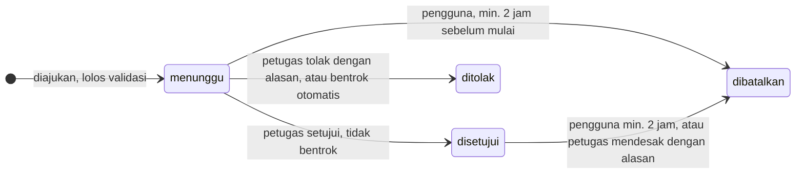

**Laporan**
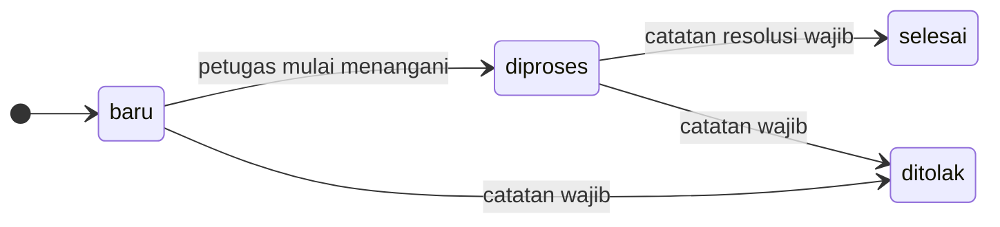

**Fasilitas**
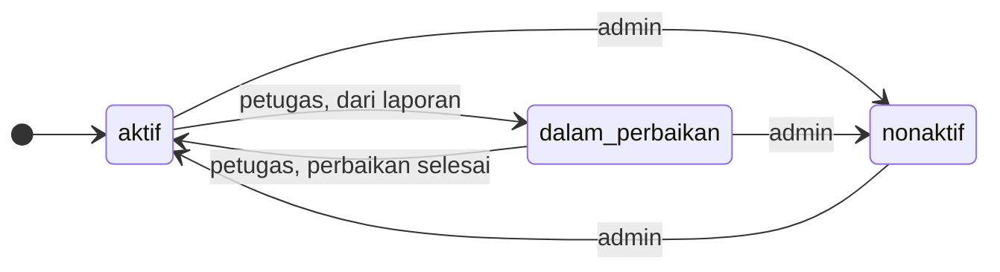

**Akun**
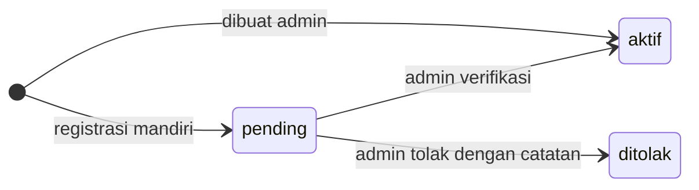

---

## 6. Skema Database & ERD

| Tabel | Kolom |
|---|---|
| `users` | id, name, email (unik), password, `role` ENUM('admin','petugas','pengguna') DEF 'pengguna', `status` ENUM('aktif','pending','ditolak') DEF 'aktif', `user_type` ENUM('mahasiswa','dosen','staf') NULL, `identity_number` VARCHAR(30) NULL (NIM/NIP), `verification_note` TEXT NULL, `verified_at` TIMESTAMP NULL, remember_token, timestamps |
| `facilities` | id, name, `type` ENUM('ruang_kelas','aula','laboratorium','alat','lapangan'), `location` VARCHAR(100) (nama gedung/area — dasar rekap per lokasi), `capacity` UNSIGNED INT, description TEXT NULL, `status` ENUM('aktif','dalam_perbaikan','nonaktif') DEF 'aktif', timestamps |
| `reservations` | id, user_id FK (cascade), facility_id FK (**restrict**), `reservation_date` DATE, `start_time` TIME, `end_time` TIME, purpose TEXT, `status` ENUM('menunggu','disetujui','ditolak','dibatalkan') DEF 'menunggu', `rejection_reason` TEXT NULL, `cancel_reason` TEXT NULL, `cancelled_by` FK users NULL (nullOnDelete), `cancelled_at` TIMESTAMP NULL, `processed_by` FK users NULL (nullOnDelete), `processed_at` TIMESTAMP NULL, timestamps · INDEX(facility_id, reservation_date, status) |
| `reports` | id, user_id FK (cascade), facility_id FK (**restrict**), `category` ENUM('kerusakan','kebersihan','peralatan','lainnya'), description TEXT, `photo` VARCHAR NULL (path relatif disk public), `status` ENUM('baru','diproses','selesai','ditolak') DEF 'baru', `resolution_note` TEXT NULL, `processed_by` FK users NULL (nullOnDelete), `processed_at` TIMESTAMP NULL, timestamps · INDEX(facility_id, status) |

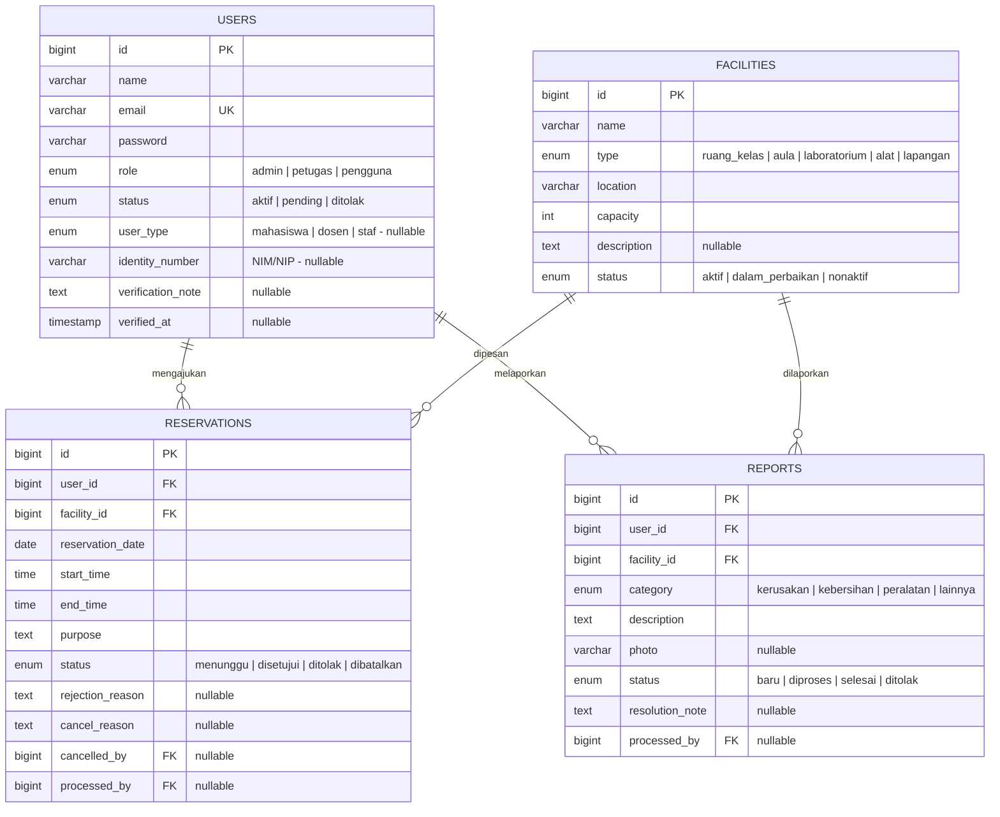

---

## 7. Kontrak Interface (dibuat PM di baseline — jangan diubah)

### 7.1 `App\Services\AvailabilityService`

| Anggota | Kontrak |
|---|---|
| Konstanta | `OPEN='07:00'`, `CLOSE='20:00'`, `SLOT_MINUTES=30`, `CANCEL_DEADLINE_MINUTES=120`, `MAX_DAYS_AHEAD=30` |
| `slots(): array` | 26 item `['start'=>'07:00','end'=>'07:30','label'=>'07.00–07.30']` |
| `startOptions(): array` | `'07:00'` … `'19:30'` (26 nilai) |
| `endOptions(): array` | `'07:30'` … `'20:00'` (26 nilai) |
| `slotStatuses(Facility $f, string $date): array` | 26 item slot + `'status' => 'tersedia'\|'tidak_tersedia'`. Fasilitas tidak `aktif` → semua `tidak_tersedia`. **Tidak pernah** mengembalikan nama pemohon/tujuan |
| `availableCount(Facility $f, string $date): int` | jumlah slot tersedia (ringkasan kartu katalog) |
| `validateRange(string $date, string $start, string $end): array` | daftar pesan error (kosong = valid): format, tanggal lampau / > 30 hari, jam di luar 07.00–20.00, bukan kelipatan 30 menit, `start >= end`, hari ini tetapi jam mulai sudah lewat |
| `hasConflict(int $facilityId, string $date, string $start, string $end, ?int $ignoreId = null): bool` | tumpang tindih dengan reservasi `disetujui` (A2) |
| `canUserCancel(Reservation $r, User $u): bool` | pemilik + status `menunggu`/`disetujui` + sekarang ≤ mulai − 120 menit (WIB) |
| `normalizeTime(string $t): string` | `'09:00:00'` / `'9:00'` → `'09:00'` |

### 7.2 Model (konstanta, helper, relasi)

| Model | Kontrak |
|---|---|
| `User` | `ROLES`, `USER_TYPES` (value ⇒ label) · `isAdmin()`, `isPetugas()`, `isPengguna()`, `isActive()` · `reservations()`, `reports()` · `$fillable`: name, email, password, user_type, identity_number |
| `Facility` | `TYPES`, `STATUSES` · `isReservable()` · scope `publicCatalog()` (aktif + dalam_perbaikan) · `reservations()`, `reports()` · `$fillable`: name, type, location, capacity, description |
| `Reservation` | `STATUSES` · `user()`, `facility()`, `processor()`, `canceller()` · scope `approved()`, `status($s)` · `timeRange()` → `'09.00–10.30'` · `startsAt()` → Carbon WIB · casts: `reservation_date => 'date'` · `$fillable`: facility_id, reservation_date, start_time, end_time, purpose |
| `Report` | `CATEGORIES`, `STATUSES` · `user()`, `facility()`, `processor()` · scope `status($s)` · `photoUrl()` · `$fillable`: facility_id, category, description, photo |

Kolom `role`, `status`, `processed_*`, `cancel*`, `rejection_reason`, `resolution_note`,
`verification_note`, `verified_at`, dan `user_id` **diisi eksplisit** di controller (D-06).

### 7.3 Route (nama & URL)

| SRS | Middleware | Route (METHOD URL → nama) |
|---|---|---|
| 001 | — / auth / role:petugas | `GET /` → redirect `/facilities` · `Auth::routes()` (login, logout, register) · `GET /home` → `home` · `GET /petugas` → `petugas.dashboard` |
| 002 | auth, role:admin | `GET /admin/users` → `admin.users.index` · `GET /admin/users/create` → `admin.users.create` · `POST /admin/users` → `admin.users.store` · `GET /admin/verifications` → `admin.verifications.index` · `PATCH /admin/verifications/{user}/approve` → `.approve` · `PATCH /admin/verifications/{user}/reject` → `.reject` |
| 003 | — (publik) | `GET /facilities` → `facilities.index` · `GET /facilities/{facility}` → `facilities.show` |
| 004 | auth, role:admin | `GET/POST /admin/facilities`, `GET /admin/facilities/create`, `GET /admin/facilities/{facility}/edit`, `PUT /admin/facilities/{facility}` → `admin.facilities.*` · `PATCH /admin/facilities/{facility}/toggle` → `admin.facilities.toggle` · `GET /admin/recap` → `admin.recap.index` · `GET /admin/recap/export` → `admin.recap.export` |
| 005 | auth, role:pengguna | `GET /reservations` · `GET /reservations/create` · `POST /reservations` · `GET /reservations/{reservation}` · `PATCH /reservations/{reservation}/cancel` → `reservations.*` |
| 006 | auth, role:petugas | `GET /petugas/reservations` · `PATCH /petugas/reservations/{reservation}/approve` · `…/reject` · `…/cancel` → `petugas.reservations.*` |
| 007 | auth, role:pengguna | `GET /reports` · `GET /reports/create` · `POST /reports` · `GET /reports/{report}` → `reports.*` |
| 008 | auth, role:petugas | `GET /petugas/reports` · `GET /petugas/reports/{report}` · `PATCH /petugas/reports/{report}/status` · `PATCH /petugas/reports/{report}/facility-status` → `petugas.reports.*` |

### 7.4 Tampilan Bersama

- Semua halaman: `@extends('layouts.app')` + `@section('content')`.
- Komponen: `<x-status-badge :status="$model->status" />` (semua status → warna Bootstrap + label
  Indonesia) · `<x-flash />` sudah dipasang di layout (`session('success')`, `session('error')`, `$errors`).
- Partial kontrak dashboard petugas: `petugas.partials.reservation-queue` (P2) dan
  `petugas.partials.report-queue` (P3), dipanggil shell via `@includeIf`. Partial boleh mengambil
  datanya sendiri (query Eloquent ringan, eager load, maks. 10 baris) karena shell tidak menyuplai data.

| Status | Warna | Status | Warna |
|---|---|---|---|
| menunggu / pending | warning | baru | primary |
| disetujui / selesai / aktif / tersedia | success | diproses | info |
| ditolak | danger | dalam_perbaikan | warning |
| dibatalkan / nonaktif / tidak_tersedia | secondary | | |

### 7.5 Middleware

Alias `role` (sudah terdaftar di `bootstrap/app.php`): `role:admin`, `role:petugas`, `role:pengguna`,
atau gabungan `role:admin,petugas`. Tamu → redirect login; status ≠ `aktif` → logout + pesan;
role tidak cocok → 403.

### 7.6 Navigasi (URL literal, bukan `route()`)

| Role | Menu |
|---|---|
| Tamu | Fasilitas `/facilities` · Masuk `/login` · Daftar `/register` |
| Pengguna | Beranda `/home` · Fasilitas `/facilities` · Reservasi Saya `/reservations` · Laporan Saya `/reports` · Keluar |
| Petugas | Dashboard `/petugas` · Antrian Reservasi `/petugas/reservations` · Antrian Laporan `/petugas/reports` · Fasilitas `/facilities` · Keluar |
| Admin | Beranda `/home` · Verifikasi `/admin/verifications` · Kelola User `/admin/users` · Kelola Fasilitas `/admin/facilities` · Rekap `/admin/recap` · Fasilitas `/facilities` · Keluar |

### 7.7 Seeder Fixture

Tanggal dihitung dinamis dari `now()` WIB: **H** = hari seed, **H+1** = besok, **H−1** = kemarin.
Kode RSV-/LPR- dipakai di skenario acceptance tiap SRS.

**Akun** (password semua: `password`)

| Email | Role | Jenis | Status | Kegunaan uji |
|---|---|---|---|---|
| admin@kampus.test | admin | – | aktif | SRS-002, 004 |
| petugas@kampus.test | petugas | – | aktif | SRS-006, 008 |
| budi@kampus.test | pengguna | mahasiswa | aktif | pemilik sebagian besar data |
| citra@kampus.test | pengguna | dosen | aktif | uji IDOR (data milik orang lain) |
| dimas@kampus.test | pengguna | staf | aktif | pasangan bentrok |
| pending@kampus.test | pengguna | mahasiswa | pending | verifikasi (002) |
| ditolak@kampus.test | pengguna | mahasiswa | ditolak + catatan | login gating (002) |

**Fasilitas**

| # | Nama | Tipe | Lokasi | Kapasitas | Status |
|---|---|---|---|---|---|
| 1 | R-101 | ruang_kelas | Gedung A | 40 | aktif |
| 2 | R-102 | ruang_kelas | Gedung A | 30 | aktif |
| 3 | Aula Utama | aula | Gedung Rektorat | 300 | aktif |
| 4 | Lab Komputer 1 | laboratorium | Gedung B | 40 | aktif |
| 5 | Lab Bahasa | laboratorium | Gedung B | 25 | dalam_perbaikan |
| 6 | Proyektor P-01 | alat | Gedung A | 1 | aktif |
| 7 | Lapangan Basket | lapangan | Area Olahraga | 20 | aktif |
| 8 | Lapangan Futsal | lapangan | Area Olahraga | 14 | nonaktif |

**Reservasi**

| Kode | Pemohon | Fasilitas | Tanggal & jam | Status | Dipakai untuk |
|---|---|---|---|---|---|
| RSV-1 | budi | Lab Komputer 1 | H+1 09.00–10.30 | disetujui | slot tidak tersedia (003); pengajuan bentrok ditolak (005) |
| RSV-2 | budi | R-101 | H+1 13.00–14.00 | menunggu | approve normal (006); batal ≥ 2 jam sukses (005) |
| RSV-3 | citra | Lapangan Basket | H+1 10.00–11.00 | disetujui | batal mendesak petugas (006); peringatan nonaktif (004) |
| RSV-4 | dimas | R-102 | H+2 10.00–11.00 | menunggu | pasangan bentrok A (006) |
| RSV-5 | citra | R-102 | H+2 10.30–11.30 | menunggu | pasangan bentrok B → tertolak otomatis setelah A disetujui (006) |
| RSV-6 | dimas | Lab Komputer 1 | H+1 10.00–11.00 | menunggu | bentrok dengan RSV-1 → approval tertolak otomatis (006) |
| RSV-7 | budi | Proyektor P-01 | H, mulai = kelipatan 30 menit terdekat setelah now()+60 menit, durasi 30 menit | disetujui | batal < 2 jam ditolak (005) — fixture boleh di luar jam operasional, tidak melewati tengah malam |
| RSV-8 | budi | R-102 | H−1 13.00–14.00 | ditolak + rejection_reason | detail alasan (005) |
| RSV-9 | budi | Lapangan Basket | H−1 15.00–16.00 | dibatalkan + cancel_reason | detail alasan (005) |
| RSV-H1..H6 | campuran | R-101, Aula Utama, Lab Komputer 1, Lapangan Basket | tersebar H−2 s.d. H−20, jam valid | disetujui | data rekap okupansi (004) |

**Laporan**

| Kode | Pelapor | Fasilitas | Kategori & isi | Status | Dipakai untuk |
|---|---|---|---|---|---|
| LPR-1 | budi | Lab Bahasa | kerusakan — AC mati | diproses | konsisten dengan fasilitas dalam_perbaikan; selesai + kembalikan aktif (008) |
| LPR-2 | dimas | Aula Utama | kerusakan — sound system mati | baru | tandai dalam_perbaikan (008) |
| LPR-3 | citra | R-102 | kebersihan — sampah menumpuk | baru | antrian (008) |
| LPR-4 | budi | Proyektor P-01 | peralatan — kabel HDMI putus | baru | tolak + catatan (008) |
| LPR-5 | budi | R-101 | kerusakan — kursi patah | selesai + resolution_note | riwayat & catatan (007) |
| LPR-6 | citra | Lapangan Futsal | kebersihan — rumput liar | ditolak + resolution_note | status ditolak (007) |
| LPR-H1..H3 | campuran | campuran | campuran | selesai | frekuensi laporan (004), `created_at` tersebar 5–25 hari lalu |

`processed_by` = petugas untuk semua data yang sudah diproses.

---

## 8. Alur Kerja Tim

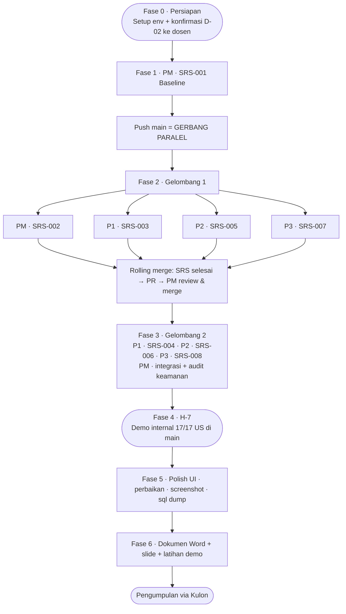

Gelombang 2 **boleh dimulai lebih awal** kapan pun — tidak bergantung pada merge gelombang 1.

---

## 9. Workflow per SRS

Setiap SRS memiliki workflow sendiri; versi realisasinya (dengan hasil uji aktual) ditulis agent
di `docs/workflow/SRS-00X-<slug>.md` dari template.

### 9.1 SRS-001 — Baseline Kritis & Fondasi

| PIC | Branch | US | Dokumen |
|---|---|---|---|
| PM | `main` | enabler semua US | `docs/workflow/SRS-001-baseline.md` |

**Langkah:** (1) proyek Laravel 13 + MySQL + WIB → (2) `laravel/ui` bootstrap --auth, reset/verify
dimatikan → (3) views ke `/views` (D-02) → (4) migration 4 tabel → (5) model + konstanta + relasi
→ (6) `AvailabilityService` + unit test → (7) `CheckRole` + alias → (8) `web.php` + 7 file route
kosong → (9) layout, navbar per role, `<x-status-badge>`, `<x-flash>`, `/home`, shell `/petugas`,
halaman 403 → (10) seeder fixture + `storage:link` → (11) `AGENTS.md`, template PR &
workflow → (12) verifikasi → push `main`.

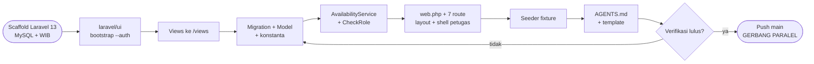

**Demo (±1 menit):** `migrate:fresh --seed` → login admin/petugas/budi (navbar berbeda per role) →
budi membuka `/petugas` → 403 → tamu membuka `/home` → diarahkan ke login.

**Acceptance (mandiri):**
- [ ] `migrate:fresh --seed` sukses dari nol; jumlah data sesuai §7.7
- [ ] `php artisan test` hijau (26 slot; 07.15 ditolak; 19.30–20.30 ditolak; bersinggungan tidak bentrok; `menunggu` tidak dihitung bentrok; `ignoreId` bekerja)
- [ ] `/petugas`: petugas 200 · budi 403 · tamu → login
- [ ] `/login` & `/register` tampil dengan Bootstrap; logout berfungsi
- [ ] Agent tiap anggota bisa menyebutkan aturan scope dari `AGENTS.md`

### 9.2 SRS-002 — Autentikasi & Manajemen Akun

| PIC | Branch | US | Dokumen |
|---|---|---|---|
| PM | `feature/auth-akun` | 13, 14, 15 | `docs/workflow/SRS-002-auth-akun.md` |

**Langkah:** (1) form registrasi + jenis pengguna & NIM/NIP; role/status diset eksplisit; tanpa login
otomatis → (2) login gating pending/ditolak → (3) admin daftar akun petugas/pengguna langsung
(role `admin` ditolak server) → (4) daftar verifikasi + setujui/tolak (+catatan) → (5) dokumen workflow.

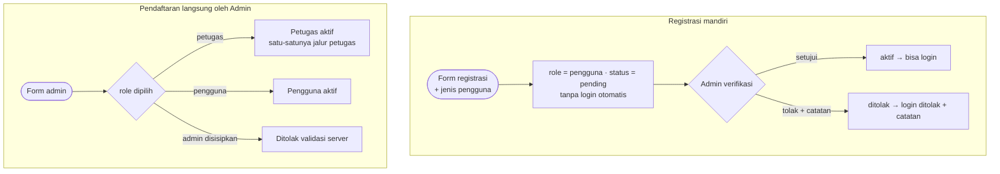

**Demo:** daftar akun baru → login ditolak "menunggu verifikasi" → admin setujui → login sukses →
admin buat petugas baru → login langsung ke `/petugas`.

**Acceptance (mandiri):**
- [ ] Registrasi tidak login otomatis; akun baru berstatus `pending`
- [ ] `pending@` dan `ditolak@` tidak bisa login (pesan sesuai, catatan tampil untuk ditolak)
- [ ] Admin menyetujui → login sukses; admin menolak → login ditolak + catatan
- [ ] Admin membuat petugas → login diarahkan ke `/petugas`
- [ ] Input `role=admin`/`status=aktif` yang disisipkan lewat DevTools pada form register diabaikan
- [ ] `POST /admin/users` dengan `role=admin` ditolak validasi; budi → `/admin/users` = 403

### 9.3 SRS-003 — Katalog & Ketersediaan Fasilitas

| PIC | Branch | US | Dokumen |
|---|---|---|---|
| P1 | `feature/fasilitas-katalog` | 1, 2 | `docs/workflow/SRS-003-fasilitas-katalog.md` |

**Langkah:** (1) katalog kartu + filter tipe/lokasi/kapasitas min/kata kunci + ringkasan "X/26 slot
tersedia hari ini" → (2) detail + pemilih tanggal + grid 26 slot → (3) banner untuk
dalam_perbaikan/nonaktif → (4) tombol "Ajukan reservasi" & "Laporkan masalah" (URL literal + query)
→ (5) cek privasi → (6) dokumen workflow.

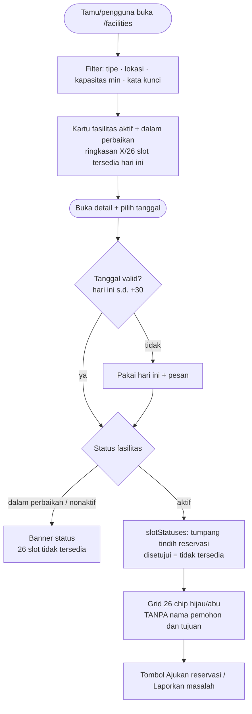

**Demo:** tamu cari "lab" kapasitas ≥ 30 → Lab Komputer 1 → pilih besok → 09.00–10.30 tidak
tersedia → buka Lab Bahasa → semua slot tidak tersedia + banner "Dalam perbaikan".

**Acceptance (mandiri):**
- [ ] Tamu tanpa login bisa mencari dan membuka detail
- [ ] Filter "lab" + kapasitas ≥ 30 → hanya Lab Komputer 1; Lapangan Futsal (nonaktif) tidak muncul
- [ ] Besok: slot 09.00, 09.30, 10.00 tidak tersedia (RSV-1); slot 10.00–11.00 tetap tersedia walau ada RSV-6 `menunggu` (A3)
- [ ] Lab Bahasa: 26 slot tidak tersedia + banner; `/facilities/8` (nonaktif) → banner nonaktif
- [ ] `?date=` invalid/di luar rentang → kembali ke hari ini + pesan
- [ ] View source halaman detail tidak memuat nama pemohon/tujuan

### 9.4 SRS-004 — Master Fasilitas & Rekap Admin

| PIC | Branch | US | Dokumen |
|---|---|---|---|
| P1 | `feature/fasilitas-admin` | 16, 17 | `docs/workflow/SRS-004-fasilitas-admin.md` |

**Langkah:** (1) tabel fasilitas + cari, tambah, edit, toggle aktif/nonaktif (bukan hapus) +
peringatan reservasi mendatang → (2) rekap dengan rentang tanggal dan pengelompokan **per fasilitas
/ per lokasi** → (3) ekspor CSV/XLSX/PDF (escape formula) → (4) dokumen workflow.

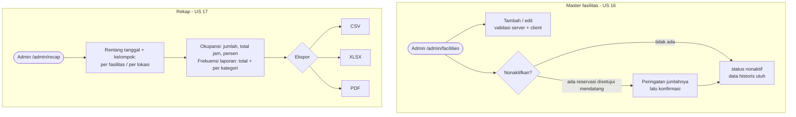

**Demo:** tambah "Lab Jaringan" → nonaktifkan Lapangan Basket (peringatan 1 reservasi mendatang:
RSV-3) → rekap per lokasi → ekspor 3 format.

**Acceptance (mandiri):**
- [ ] Tambah/edit tervalidasi (nama & lokasi wajib, tipe `in:`, kapasitas ≥ 1)
- [ ] Toggle nonaktif mengubah status tanpa menghapus data; peringatan muncul untuk Lapangan Basket
- [ ] Rekap per fasilitas & per lokasi memakai data RSV-H/LPR-H; persentase okupansi sesuai A11
- [ ] Ekspor CSV, XLSX, PDF terunduh dan isinya sama dengan tabel
- [ ] Nama fasilitas `=1+1` diekspor sebagai teks (tidak dieksekusi Excel)
- [ ] Pengguna/petugas → `/admin/facilities` = 403

### 9.5 SRS-005 — Reservasi Pengguna

| PIC | Branch | US | Dokumen |
|---|---|---|---|
| P2 | `feature/reservasi-user` | 3, 4, 5 | `docs/workflow/SRS-005-reservasi-user.md` |

**Langkah:** (1) form ala Calendly: fasilitas aktif → tanggal → jam mulai/selesai → tujuan (prefill
dari query) → (2) server: `validateRange` → `isReservable` → `hasConflict` → simpan `menunggu` →
(3) riwayat + filter status → (4) detail (Policy pemilik) → (5) batal (Policy + `canUserCancel`) →
(6) dokumen workflow.

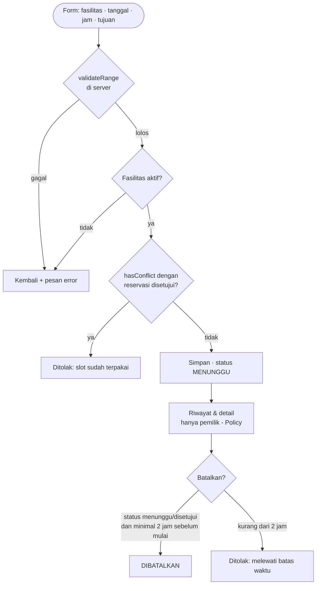

**Demo:** ajukan R-101 lusa 08.00–09.00 → `menunggu` → coba Lab Komputer 1 besok 09.30–10.00 →
ditolak bentrok → coba 07.15 → ditolak → batalkan RSV-2 → sukses → batalkan RSV-7 → ditolak.

**Acceptance (mandiri):**
- [ ] Pengajuan valid tersimpan `menunggu` dan tampil di riwayat dengan badge
- [ ] Bentrok dengan RSV-1 ditolak server; 07.15, 20.30, 19.30–20.30, `start ≥ end`, tanggal lampau, > 30 hari → ditolak server
- [ ] `facility_id` Lab Bahasa/Lapangan Futsal dikirim manual (DevTools) → ditolak server
- [ ] Batal RSV-2 sukses; batal RSV-7 ditolak; batal RSV-8 (ditolak) tidak tersedia
- [ ] Detail RSV-8/RSV-9 menampilkan alasan
- [ ] budi membuka `/reservations/{id RSV-3}` (milik citra) → 403

### 9.6 SRS-006 — Pemrosesan Reservasi Petugas

| PIC | Branch | US | Dokumen |
|---|---|---|---|
| P2 | `feature/reservasi-petugas` | 8, 9, 10 | `docs/workflow/SRS-006-reservasi-petugas.md` |

**Langkah:** (1) partial antrian `menunggu` di dashboard → (2) halaman antrian dengan tab menunggu /
disetujui mendatang / semua, penanda "berpotensi bentrok" → (3) setujui dalam transaksi + kunci baris
fasilitas + re-check → (4) tolak + alasan wajib → (5) batal mendesak + alasan wajib → (6) dokumen workflow.

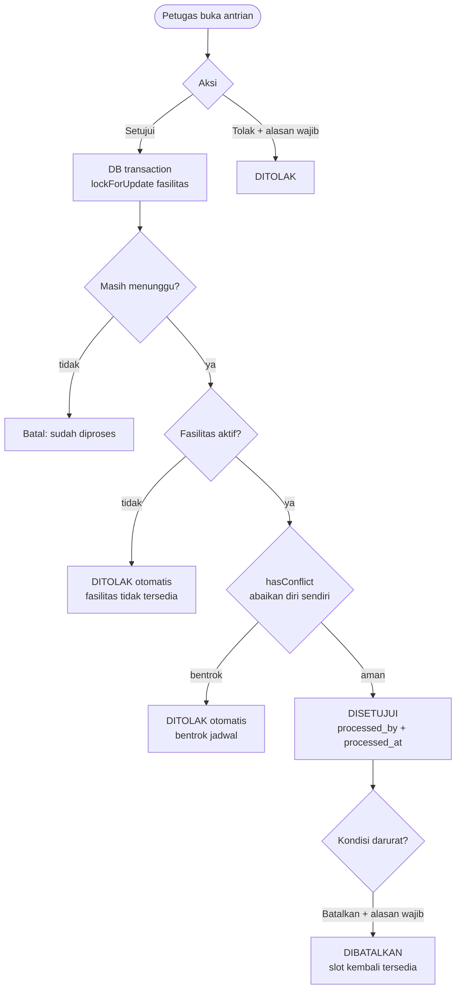

**Demo:** dashboard menampilkan antrian → setujui RSV-4 → setujui RSV-5 → tertolak otomatis
"bentrok" → setujui RSV-6 → tertolak (bentrok RSV-1) → batalkan RSV-3 dengan alasan.

**Acceptance (mandiri):**
- [ ] Partial antrian tampil di `/petugas` (RSV-2, 4, 5, 6)
- [ ] RSV-2 disetujui; RSV-4 disetujui lalu RSV-5 tertolak otomatis dengan alasan bentrok
- [ ] RSV-6 tertolak otomatis (bentrok RSV-1)
- [ ] Tolak tanpa alasan → ditolak server; batal mendesak tanpa alasan → ditolak server
- [ ] Batal mendesak hanya untuk `disetujui` yang belum lewat
- [ ] Dua tab browser menyetujui RSV-4 dan RSV-5 hampir bersamaan → hanya satu yang disetujui
- [ ] budi → `/petugas/reservations` = 403

### 9.7 SRS-007 — Laporan Pengguna

| PIC | Branch | US | Dokumen |
|---|---|---|---|
| P3 | `feature/laporan-user` | 6, 7 | `docs/workflow/SRS-007-laporan-user.md` |

**Langkah:** (1) form laporan: fasilitas (prefill query), kategori, deskripsi, foto opsional + preview
→ (2) validasi server & simpan foto bernama acak → (3) daftar laporan saya + filter status →
(4) detail (Policy pelapor) → (5) dokumen workflow.

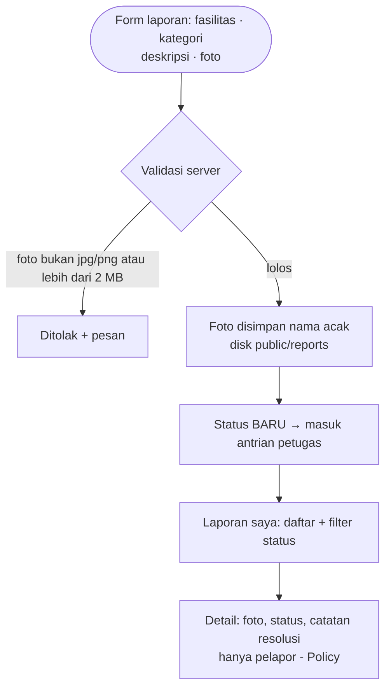

**Demo:** laporkan R-101 "kerusakan" + foto jpg → tampil `baru` → buka LPR-5 → catatan resolusi tampil.

**Acceptance (mandiri):**
- [ ] Laporan dengan foto jpg tersimpan dan fotonya tampil; tanpa foto juga bisa
- [ ] Upload pdf, file > 2 MB, dan `shell.php` yang diganti nama menjadi `.jpg` → ditolak server
- [ ] Riwayat menampilkan LPR-1, 4, 5 milik budi dengan badge; filter status bekerja
- [ ] Detail LPR-5 menampilkan catatan resolusi dan petugas pemroses
- [ ] Deskripsi berisi `<script>alert(1)</script>` tampil sebagai teks
- [ ] budi membuka laporan milik citra (LPR-3) → 403

### 9.8 SRS-008 — Pemrosesan Laporan & Status Perbaikan

| PIC | Branch | US | Dokumen |
|---|---|---|---|
| P3 | `feature/laporan-petugas` | 8, 11, 12 | `docs/workflow/SRS-008-laporan-petugas.md` |

**Langkah:** (1) partial antrian laporan `baru` + `diproses` → (2) halaman antrian & detail → (3)
transisi status valid saja; catatan wajib saat menutup → (4) tombol "Tandai dalam perbaikan" /
"Selesaikan perbaikan" (hanya `aktif ↔ dalam_perbaikan`) → (5) dokumen workflow.

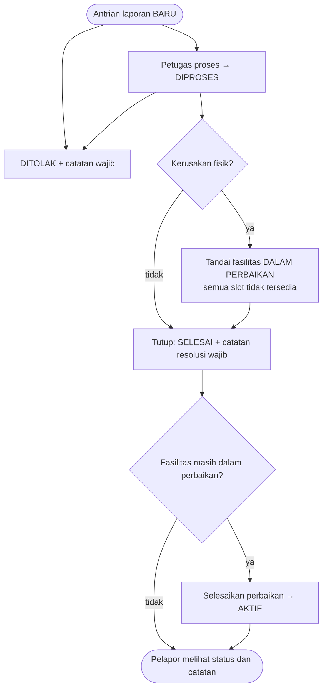

**Demo:** LPR-2 → proses → tandai Aula Utama dalam perbaikan → selesaikan laporan + catatan →
kembalikan Aula aktif; LPR-4 → tolak + catatan.

**Acceptance (mandiri):**
- [ ] Partial antrian tampil di `/petugas` (LPR-1 s.d. LPR-4)
- [ ] Transisi valid: baru→diproses, baru→ditolak, diproses→selesai, diproses→ditolak; lainnya ditolak server
- [ ] Menutup tanpa catatan → ditolak server; dengan catatan → sukses + `processed_by`/`processed_at`
- [ ] Aula Utama berubah `dalam_perbaikan` lalu `aktif` (cek badge di detail laporan / DB)
- [ ] Request manual mengaktifkan Lapangan Futsal (nonaktif) → ditolak server
- [ ] budi → `/petugas/reports` = 403
- [ ] *(Integrasi setelah merge 003)* slot Aula tampil tidak tersedia selama dalam perbaikan

---

## 10. Tahapan Kerja

Tahapan bersifat berurutan tanpa tanggal kalender. Tim menyesuaikan durasinya sendiri; satu-satunya
patokan adalah **Fase 4 (H-7)** yang jatuh tujuh hari sebelum batas pengumpulan.

| Fase | Aktivitas | PIC | Selesai jika |
|---|---|---|---|
| 0 · Persiapan | Semua: siapkan env (PHP 8.3 + ekstensi, Composer, Node, MySQL 9.5), akun GitHub, `git config`. PM: konfirmasi D-02 ke dosen | semua | semua anggota bisa `php -v`, `composer -V`, `mysql` |
| 1 · Baseline | **SRS-001** → push `main` (anggota lain: pelajari US & kontrak, siapkan prompt, sketsa UI) | PM | acceptance §9.1 lulus |
| 2 · Gelombang 1 | Paralel: 002 (PM) · 003 (P1) · 005 (P2) · 007 (P3) + rolling merge | semua | 4 PR ter-merge |
| 3 · Gelombang 2 | Paralel: 004 (P1) · 006 (P2) · 008 (P3) · PM integrasi + audit keamanan (§12). Boleh dimulai bersamaan dengan Fase 2 | semua | 3 PR ter-merge + audit selesai |
| **4 · H-7** | **Demo internal: 17/17 user story jalan di `main`** — catat gap | semua | 17/17 US lulus |
| 5 · Polish | Perbaikan gap, polish UI, screenshot per fitur (`docs/screenshots/`), `mysqldump` → `database/reservus.sql` | semua | DoD §15 terpenuhi |
| 6 · Dokumen | Dokumen Word + slide + latihan demo 10 menit; kumpulkan lebih awal dari batas sebagai cadangan | PM + semua | file terkumpul via Kulon |

---

## 11. Git Workflow & Rolling Merge

```bash
# Sekali per laptop: identitas git = akun GitHub (agar commit terhitung sebagai kontribusi)
git config --global user.name  "Nama Lengkap"
git config --global user.email "email-yang-terdaftar-di-github@contoh.com"

# Mulai SRS — selalu dari main terbaru
git checkout main && git pull origin main
git checkout -b feature/reservasi-user

# Selama bekerja: commit kecil & jelas
git commit -m "feat(reservasi): validasi server slot 30 menit (SRS-005, US-3)"

# Sebelum membuka PR: tarik main, uji ulang
git fetch origin && git merge origin/main
php artisan migrate:fresh --seed
git push -u origin feature/reservasi-user     # buka PR ke main di GitHub
```

**Konvensi commit:** `<tipe>(<domain>): <ringkasan> (SRS-00X, US-n)` — tipe: `feat`, `fix`, `docs`,
`style`, `refactor`, `test`, `chore`; domain: `baseline`, `akun`, `fasilitas`, `reservasi`, `laporan`.

**Checklist PR** (template `.github/pull_request_template.md`):
- [ ] Hanya file milik SRS ini yang berubah (`git diff --name-only origin/main...HEAD`)
- [ ] Tidak ada migration/model/service/layout yang diubah
- [ ] `migrate:fresh --seed` + seluruh acceptance lulus
- [ ] `docs/workflow/SRS-00X-<slug>.md` terisi lengkap
- [ ] Pesan commit mengikuti konvensi

PM me-review dan merge dengan **Create a merge commit** (D-09).

---

## 12. Checklist Keamanan & Uji Serang Mandiri

Jalankan oleh PM (audit) sebelum H-7 dan oleh tiap pemilik SRS di acceptance-nya.

| Area | Kontrol wajib | Uji serang mandiri | SRS |
|---|---|---|---|
| IDOR | Policy pemilik untuk detail/batal reservasi & detail laporan | ganti ID di URL ke milik akun lain → 403 | 005, 007 |
| Forced browsing | `role:` di semua route non-publik | budi membuka `/petugas`, `/admin/*` → 403 | semua |
| Eskalasi privilese | role/status tidak di `$fillable`; `in:petugas,pengguna` di form admin | sisipkan `role=admin` di form register & form admin | 002 |
| Mass assignment | kolom proses diisi eksplisit | sisipkan `status=disetujui` saat mengajukan reservasi | 005, 007 |
| Race condition (TOCTOU) | approve dalam `DB::transaction` + `lockForUpdate()` | dua tab menyetujui dua reservasi bentrok bersamaan | 006 |
| Validasi bisnis | `validateRange` + `isReservable` di server | kirim jam 07.15 / fasilitas nonaktif lewat DevTools | 005 |
| Upload | `image\|mimes:jpg,jpeg,png\|max:2048`, nama acak dari `store()` | pdf, file besar, PHP berganti ekstensi `.jpg` | 007 |
| XSS | selalu `{{ }}`; teks multibaris `{!! nl2br(e($x)) !!}` | `<script>` di tujuan, deskripsi, nama fasilitas | semua |
| CSRF | `@csrf` di semua form, method spoofing `@method` | kirim POST tanpa token → 419 | semua |
| Privasi US 1 | `slotStatuses` tanpa data pemohon | view source halaman detail publik | 003 |
| CSV/Formula injection | escape sel berawalan `= + - @` | fasilitas bernama `=HYPERLINK("http://x","klik")` lalu ekspor | 004 |
| Brute force login | throttle bawaan `laravel/ui` tetap aktif | 6× salah password → terkunci sementara | 002 |
| Transisi status | whitelist transisi di server | PATCH status `selesai → baru`; aktifkan fasilitas nonaktif | 006, 008 |

---

## 13. Kepatuhan Ketentuan Umum

| Ketentuan | Cara dipenuhi |
|---|---|
| Auth: registrasi, login, logout | `laravel/ui` + status verifikasi (SRS-001/002) |
| Struktur kode terpisah: koneksi DB / tampilan / logika | Koneksi: `/config/database.php` + `.env` · Tampilan: `/views` · Logika: `/app/Http/Controllers`, `/app/Models`, `/app/Services` |
| Folder minimal `/public`, `/app` (model/controller), `/views`, `/config` | Terpenuhi literal: `/public` & `/config` bawaan, `/app/Models` + `/app/Http/Controllers`, `/views` (D-02) |
| Validasi server + client untuk form penting | Server: Validator + `AvailabilityService` + Policy · Client: HTML5 (`required`, `type`, `min`, `max`, `accept`) + JS ringan |
| UI/UX mudah digunakan | Bootstrap 5; pola Skedda/Calendly/Booking.com; badge status konsisten; empty state & pesan jelas |
| Repo bersama, commit semua anggota, pesan jelas | Branch per SRS, konvensi commit, merge commit (D-09) |
| Kontribusi aktif semua anggota | 8 SRS: 2 per orang + baseline PM; dokumen workflow per SRS sebagai bukti |

---

## 14. Checklist Deliverable

**Dokumen Word (via Kulon):**
- [ ] Nama & NIM seluruh anggota
- [ ] Pembagian tugas (tabel §4 + ringkasan tiap `docs/workflow/SRS-00X-*.md`)
- [ ] Link Google Drive: source code (zip repo **tanpa** `vendor/` & `node_modules/`), `database/reservus.sql`, panduan
- [ ] Informasi setting (§16)
- [ ] Informasi login tiap aktor (§16.4; pengunjung tanpa login)
- [ ] Screenshot + penjelasan singkat per fitur (dari bagian Screenshot tiap dokumen workflow, urut US 1–17)

**Slide UTS (10 menit):** latar belakang (1) · arsitektur & pembagian SRS (1,5) · demo per domain:
katalog → reservasi → laporan → admin (5) · kendala & solusi (1,5) · penutup (1).
Siapkan jawaban: "bagaimana mencegah bentrok (termasuk dua petugas bersamaan)?", "kenapa validasi di
server?", "bagaimana kontrol akses per role & per pemilik data?", "bagaimana tim bekerja paralel
tanpa konflik?".

---

## 15. Definition of Done

- [ ] 17/17 user story lulus di `main` pada Fase 4 (H-7)
- [ ] Dari nol: `clone` → `composer install` → `.env` → `migrate:fresh --seed` → `storage:link` → `npm run build` → `serve` mulus
- [ ] Semua form penting tervalidasi server & client
- [ ] Ekspor CSV/XLSX/PDF berfungsi
- [ ] Checklist keamanan §12 lulus
- [ ] 8 dokumen `docs/workflow/SRS-00X-*.md` lengkap
- [ ] Dokumen Word terkumpul via Kulon sebelum batas waktu
- [ ] Setiap anggota mampu menjelaskan kodenya sendiri (kode AI wajib dipahami)

---

## 16. Cara Menjalankan Aplikasi

### 16.1 Prasyarat
PHP ≥ 8.3 dengan ekstensi `pdo_mysql`, `mbstring`, `fileinfo`, `gd`, `zip` (`gd` & `zip` dibutuhkan
ekspor Excel/PDF) · Composer 2 · Node ≥ 20 · MySQL Server 9.5 · Git.

### 16.2 Langkah
```bash
git clone <url-repo> reservus && cd reservus
composer install
cp .env.example .env
php artisan key:generate
# MySQL: CREATE DATABASE reservus CHARACTER SET utf8mb4 COLLATE utf8mb4_unicode_ci;
php artisan migrate:fresh --seed
php artisan storage:link        # wajib agar foto laporan tampil
npm install && npm run build
php artisan serve               # http://127.0.0.1:8000
```

Baris penting `.env`:
```dotenv
APP_NAME=Reservus
APP_TIMEZONE=Asia/Jakarta
APP_LOCALE=id
DB_CONNECTION=mysql
DB_HOST=127.0.0.1
DB_PORT=3306
DB_DATABASE=reservus
DB_USERNAME=root
DB_PASSWORD=
```

### 16.3 Troubleshooting

| Gejala | Penyebab & solusi |
|---|---|
| `Unknown database 'reservus'` | buat database dulu (§16.2) |
| `authentication method unknown` | PHP ≥ 8.3 dengan `mysqlnd`; MySQL 9.x hanya memakai `caching_sha2_password` |
| `could not find driver` | aktifkan `pdo_mysql` di `php.ini` |
| `View [...] not found` | view harus berada di `/views` (D-02); jalankan `php artisan view:clear` |
| `Call to undefined method ...::middleware()` | stub controller `laravel/ui` pada Laravel 11+ — ikuti perbaikan di prompt baseline |
| Ekspor gagal / `ext-gd` atau `ext-zip` missing | aktifkan ekstensi `gd` dan `zip` di `php.ini` |
| Foto laporan tidak tampil | lupa `php artisan storage:link` |
| Batas batal 2 jam meleset ± 7 jam | `APP_TIMEZONE=Asia/Jakarta` belum diset → `php artisan config:clear` |
| Data demo "kemarin/besok" tidak cocok | seed ulang: `php artisan migrate:fresh --seed` (tanggal dinamis) |

### 16.4 Akun Demo

| Aktor | Email | Password | Catatan |
|---|---|---|---|
| Pengunjung | — | — | tanpa login: buka `/facilities` |
| Admin | admin@kampus.test | password | |
| Petugas | petugas@kampus.test | password | |
| Pengguna (mahasiswa) | budi@kampus.test | password | paling banyak data |
| Pengguna (dosen/staf) | citra@kampus.test · dimas@kampus.test | password | |
| Pengguna pending | pending@kampus.test | password | untuk demo verifikasi |
| Pengguna ditolak | ditolak@kampus.test | password | untuk demo login gating |