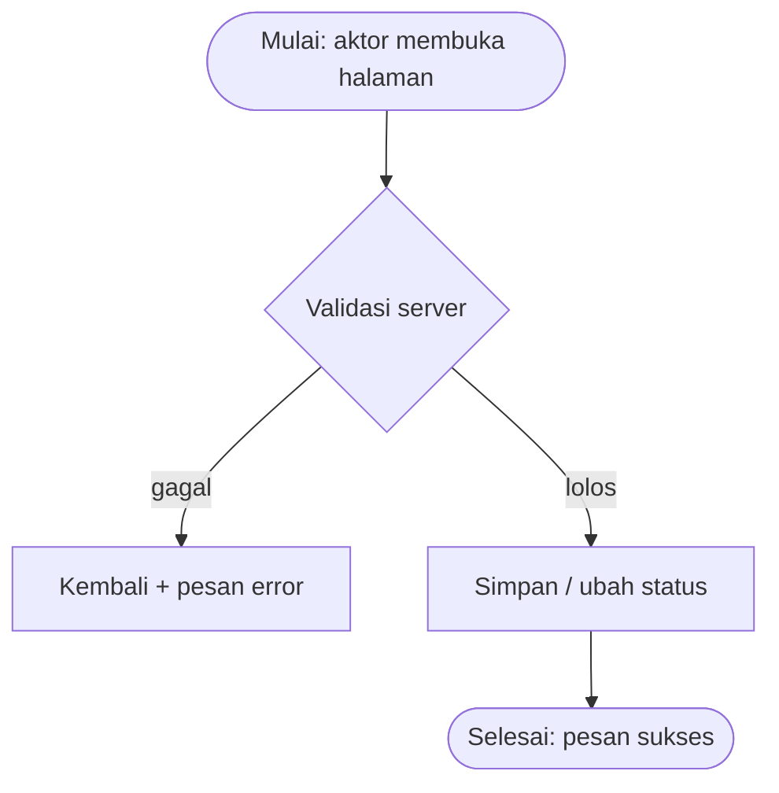

# SRS-00X — <Nama SRS>

<!--
CARA PAKAI (hapus blok komentar ini setelah diisi)
1. Salin file ini menjadi docs/workflow/SRS-00X-<slug>.md, contoh: SRS-005-reservasi-user.md
   Slug resmi: 001-baseline · 002-auth-akun · 003-fasilitas-katalog · 004-fasilitas-admin ·
   005-reservasi-user · 006-reservasi-petugas · 007-laporan-user · 008-laporan-petugas
2. Isi SEMUA bagian berdasarkan apa yang BENAR-BENAR diimplementasikan (bukan rencana).
3. Hasil uji wajib hasil aktual. Gagal pun ditulis apa adanya + rencana perbaikan.
4. Screenshot disimpan di docs/screenshots/SRS-00X-NN.png (NN = 01, 02, ...).
5. Commit: docs(<domain>): workflow SRS-00X
-->

| Info | Isi |
|---|---|
| SRS | SRS-00X — `<nama SRS>` |
| PIC | `<nama>` (`<PM / Programmer 1 / 2 / 3>`) |
| Branch | `feature/<slug>` |
| User Story | US-`<n>`, US-`<n>` |
| Agent AI yang dipakai | `<Claude Code / Antigravity / OpenCode / Hermes / lainnya>` |
| Status | 🟡 Dikerjakan · 🔵 PR dibuka · 🟢 Merged ke `main` |
| Periode | `<tgl mulai>` – `<tgl selesai>` |
| Pull Request | `<link PR>` |

---

## 1. Ringkasan

<!-- 2–3 kalimat: apa yang dibangun, untuk aktor siapa, dan masalah apa yang diselesaikan. -->

## 2. Cakupan User Story

| US | Pernyataan (ringkas) | Status | Bukti (URL / halaman) |
|---|---|---|---|
| US-x | Sebagai …, saya bisa … | ✅ / ⚠️ / ❌ | `GET /…` |

## 3. File yang Dibuat / Diubah

<!-- Sumber: git diff --name-status origin/main...HEAD
     Semua file HARUS termasuk kepemilikan SRS ini (AGENTS.md bagian F). -->

| Status | File | Keterangan |
|---|---|---|
| A (baru) | `routes/<slug>.php` | … |
| M (ubah) | `…` | … |

## 4. Route

<!-- Sumber: php artisan route:list --path=<prefix> -->

| Method | URL | Nama route | Middleware | Keterangan |
|---|---|---|---|---|
| GET | `/…` | `….index` | `auth, role:…` | … |

## 5. Alur Proses

<!-- Flowchart alur yang BENAR-BENAR diimplementasikan. Label node pakai tanda kutip. -->



## 6. Aturan Bisnis & Validasi

| Field / aturan | Validasi server | Validasi client | Pesan error |
|---|---|---|---|
| `…` | `required\|…` / service | `required`, `min`, `max`, JS | "…" |

## 7. Keamanan

- [ ] Route non-publik memakai `role:` yang tepat
- [ ] Otorisasi pemilik data via Policy + `Gate::authorize()` (bila relevan)
- [ ] Tidak ada `$request->all()`; kolom role/status/proses diisi eksplisit
- [ ] Enum divalidasi `Rule::in(array_keys(...))`
- [ ] Output memakai `{{ }}` / `{!! nl2br(e(...)) !!}`
- [ ] Semua form memakai `@csrf` (+ `@method` bila perlu)
- [ ] Upload tervalidasi `image|mimes|max` (bila relevan)
- [ ] Transisi status ber-whitelist di server (bila relevan)
- [ ] Catatan tambahan: …

## 8. Uji Acceptance

Data uji: seeder baseline — kode yang dipakai: `RSV-…`, `LPR-…`, akun `…@kampus.test`.
Perintah persiapan: `php artisan migrate:fresh --seed && php artisan serve`

| No | Skenario | Langkah | Hasil diharapkan | Hasil aktual | Status |
|---|---|---|---|---|---|
| 1 | … | 1) … 2) … | … | … | ✅ / ❌ |
| 2 | Uji serang: … | … | 403 / ditolak server | … | ✅ / ❌ |

Hasil `php artisan test` (bila ada test): `<x passed, y failed>`

## 9. Screenshot

| No | Fitur | File | Penjelasan singkat (untuk dokumen Word) |
|---|---|---|---|
| 1 | … | `docs/screenshots/SRS-00X-01.png` | … |
| 2 | … | `docs/screenshots/SRS-00X-02.png` | … |

## 10. Kendala & Solusi

| Kendala | Penyebab | Solusi |
|---|---|---|
| … | … | … |

## 11. HANDOFF UNTUK PM

<!-- Kebutuhan di luar scope SRS ini. Tulis "Tidak ada" bila kosong. -->

| Kebutuhan | File terkait | Alasan | Dampak bila tidak ada | Status |
|---|---|---|---|---|
| … | … | … | … | Menunggu / Selesai |

## 12. Riwayat Commit

<!-- Sumber: git log --oneline --author="<nama>" origin/main..HEAD -->

```text
<hash> feat(<domain>): … (SRS-00X, US-n)
<hash> docs(<domain>): workflow SRS-00X
```

## 13. Poin Presentasi (± 1 menit)

1. **Masalah yang diselesaikan:** …
2. **Demo singkat:** langkah 1 → 2 → 3 (akun `…@kampus.test`)
3. **Keputusan teknis yang layak dibanggakan:** …
4. **Kendala terbesar & cara mengatasinya:** …
5. **Pertanyaan yang mungkin muncul & jawabannya:** …
