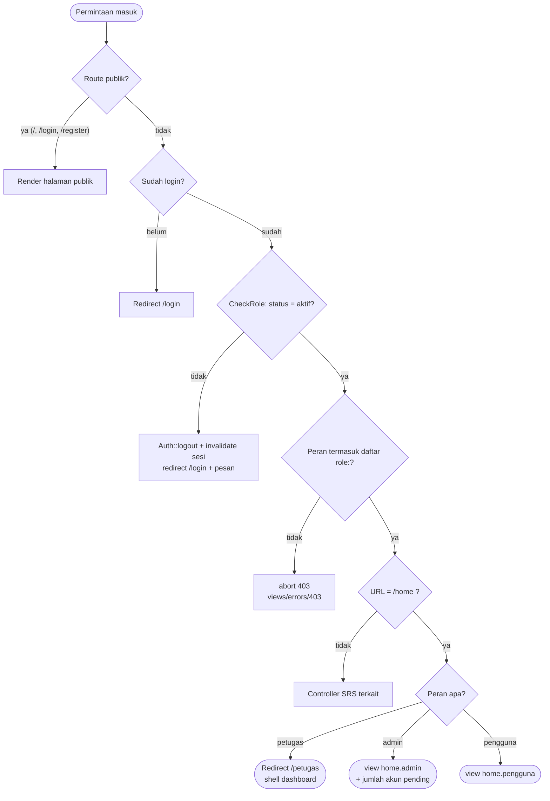

# SRS-001 — Baseline Kritis & Fondasi

| Info | Isi |
|---|---|
| SRS | SRS-001 — Baseline Kritis & Fondasi |
| PIC | PM (hybrid) |
| Branch | `main` |
| User Story | *enabler* untuk seluruh US 1–17 (tidak ada US yang diselesaikan langsung) |
| Agent AI yang dipakai | Claude Code (Opus 5) |
| Status | 🟢 Selesai di `main` (gerbang paralel dibuka) |
| Periode | 2026-09-20 – 2026-09-20 |
| Pull Request | — (SRS-001 dikerjakan langsung di `main` sesuai README §4) |

---

## 1. Ringkasan

Baseline menyiapkan seluruh fondasi teknis Reservus sehingga tujuh SRS berikutnya dapat dikerjakan
**paralel tanpa saling menunggu dan tanpa konflik Git**: proyek Laravel 13 + MySQL + zona WIB,
starter kit `laravel/ui` (Bootstrap 5), folder tampilan `/views`, empat tabel beserta model dan
konstanta berlabel Indonesia, `AvailabilityService` sebagai satu-satunya sumber kebenaran aturan
slot/bentrok/pembatalan, middleware `role`, satu file route kosong per SRS, layout + komponen
bersama, halaman beranda per peran, shell dashboard petugas, serta seeder fixture yang membuat tiap
SRS punya data uji mandiri.

## 2. Cakupan User Story

SRS-001 tidak menyelesaikan user story secara langsung; ia menyediakan kontrak yang dipakai semua US.

| Kontrak | Dipakai oleh | Status | Bukti |
|---|---|---|---|
| `AvailabilityService` (26 slot, bentrok, batas batal) | US 1–5, 8–10 | ✅ | `app/Services/AvailabilityService.php`, 17 test hijau |
| Model + konstanta value ⇒ label Indonesia | semua US | ✅ | `app/Models/*.php` |
| Middleware `role` + alias | semua US | ✅ | `GET /petugas`: petugas 200 · pengguna 403 |
| Layout, navbar per peran, `<x-status-badge>`, `<x-flash>` | semua US | ✅ | `views/layouts/app.blade.php` |
| Tujuh file route kosong (D-03) | SRS-002…008 | ✅ | `routes/*.php` |
| Seeder fixture (7 akun, 8 fasilitas, 15 reservasi, 9 laporan) | semua SRS | ✅ | `php artisan migrate:fresh --seed` |
| Shell `/petugas` dengan titik pasang partial | SRS-006, SRS-008 | ✅ | "Modul belum terpasang." tampil sebelum partial ada |

## 3. File yang Dibuat / Diubah

Seluruh riwayat baseline adalah commit awal repositori (tidak ada `origin/main` pembanding), jadi
daftar berikut adalah file inti yang dibuat/diubah manual di luar scaffold bawaan Laravel.

| Status | File | Keterangan |
|---|---|---|
| M | `.env`, `.env.example` | `APP_NAME=Reservus`, `APP_TIMEZONE=Asia/Jakarta`, `APP_LOCALE=id`, MySQL `reservus`, `FILESYSTEM_DISK=public` |
| M | `config/app.php` | `'timezone' => env('APP_TIMEZONE', 'UTC')` (D-04) |
| M | `config/view.php` | `'paths' => [base_path('views')]` (D-02) |
| M | `package.json`, `resources/js/app.js` | Tailwind dibuang; Bootstrap 5 JS di-expose ke `window.bootstrap` |
| D | `CLAUDE.md` (bawaan starter), `resources/views/*`, `welcome.blade.php` | D-10 & D-02 |
| A | `database/migrations/2026_01_01_000001_add_role_status_to_users_table.php` | role, status, user_type, identity_number, verification_note, verified_at |
| A | `database/migrations/2026_01_01_00000{2,3,4}_*.php` | facilities, reservations, reports (+ index & FK sesuai README §6) |
| A | `app/Models/{User,Facility,Reservation,Report}.php` | konstanta, relasi, scope, helper, `casts()`, `$fillable` (D-05, D-06) |
| A | `app/Services/AvailabilityService.php` | kontrak E1 lengkap |
| A | `app/Http/Middleware/CheckRole.php` | alias `role` |
| M | `bootstrap/app.php` | registrasi alias `role` + `redirectGuestsTo('/login')` |
| M | `routes/web.php` | `/` → `/facilities`, `Auth::routes([...])`, `/home`, `/petugas`, 7 `require` |
| A | `routes/{auth-akun,fasilitas-katalog,fasilitas-admin,reservasi-user,reservasi-petugas,laporan-user,laporan-petugas}.php` | file kosong berheader pemilik (D-03) |
| A | `app/Http/Controllers/HomeController.php` | invokable, menyalurkan per peran |
| A | `app/Http/Controllers/Petugas/DashboardController.php` | shell dashboard |
| M | `app/Http/Controllers/Auth/{Login,Register}Controller.php` | `HasMiddleware` + `static middleware()`; `$redirectTo='/home'` |
| D | `app/Http/Controllers/Auth/{ForgotPassword,ResetPassword,Verification,ConfirmPassword}Controller.php` | D-07 |
| A | `views/layouts/app.blade.php`, `views/components/{flash,status-badge}.blade.php` | tampilan bersama (E4) |
| A | `views/home/{admin,pengguna}.blade.php`, `views/petugas/dashboard.blade.php`, `views/errors/403.blade.php` | halaman baseline |
| A | `lang/id/{validation,auth,pagination}.php`, `lang/id.json` | pesan Bahasa Indonesia |
| A | `database/seeders/{User,Facility,Reservation,Report}Seeder.php`, `DatabaseSeeder.php` | fixture README §7.7 |
| A | `database/factories/{Facility,Reservation,Report}Factory.php` | kebutuhan pengujian |
| A | `tests/Feature/{AvailabilityServiceTest,BaselineAccessTest}.php` | 27 test |
| A | `.github/pull_request_template.md`, `docs/workflow/`, `docs/screenshots/` | perangkat proses |

## 4. Route

Hasil `php artisan route:list` setelah baseline (tujuh file route SRS lain masih kosong).

| Method | URL | Nama route | Middleware | Keterangan |
|---|---|---|---|---|
| ANY | `/` | — | `web` | redirect permanen ke `/facilities` |
| GET | `/login` | `login` | `web`, `guest` | form masuk (Bootstrap) |
| POST | `/login` | — | `web`, `guest` | throttle bawaan `laravel/ui` aktif |
| POST | `/logout` | `logout` | `web`, `auth` | keluar |
| GET | `/register` | `register` | `web`, `guest` | form daftar (disempurnakan di SRS-002) |
| POST | `/register` | — | `web`, `guest` | — |
| GET | `/home` | `home` | `web`, `auth`, `role:admin,petugas,pengguna` | beranda per peran |
| GET | `/petugas` | `petugas.dashboard` | `web`, `auth`, `role:petugas` | shell dashboard petugas |

Route `password.request`, `password.reset`, `verification.*`, dan `password.confirm` **tidak ada**
(D-07) — diuji otomatis di `BaselineAccessTest`.

## 5. Alur Proses



## 6. Aturan Bisnis & Validasi

Baseline tidak memiliki form data selain auth bawaan; yang disediakan adalah **mesin validasi**
yang dipakai SRS lain.

| Aturan (AGENTS.md bagian B) | Implementasi server | Dukungan client | Pesan |
|---|---|---|---|
| Jam operasional 07.00–20.00, kelipatan 30 menit | `AvailabilityService::validateRange()` | `startOptions()`/`endOptions()` untuk `<select>` | "Jam reservasi harus berada dalam jam operasional 07.00–20.00." / "Jam mulai dan selesai harus kelipatan 30 menit." |
| `start < end` | `validateRange()` | urutan opsi | "Jam selesai harus setelah jam mulai." |
| Tanggal hari ini s.d. +30 hari | `validateRange()` + `MAX_DAYS_AHEAD` | `min`/`max` pada `<input type="date">` | "Tanggal reservasi paling jauh 30 hari dari hari ini." |
| Hari ini → jam mulai setelah sekarang | `validateRange()` (WIB) | — | "Untuk hari ini, jam mulai harus setelah waktu sekarang." |
| Bentrok hanya dengan reservasi `disetujui` | `hasConflict()` (`start_lama < end_baru AND end_lama > start_baru`) | grid slot | dipakai SRS-005/006 |
| Reservasi `menunggu` tidak mengunci slot | `slotStatuses()` hanya membaca `scopeApproved()` | — | — |
| Fasilitas non-`aktif` tidak bisa direservasi | `Facility::isReservable()` + `slotStatuses()` → 26 `tidak_tersedia` | badge status | — |
| Batas batal 2 jam (WIB) | `canUserCancel()` + `CANCEL_DEADLINE_MINUTES` | tombol disembunyikan | dipakai SRS-005 |
| Hanya akun `aktif` boleh memakai aplikasi | `CheckRole` | — | "Akun Anda belum aktif. Hubungi admin." |

Pesan validasi Laravel sudah berbahasa Indonesia melalui `lang/id/validation.php`
(termasuk daftar `attributes` untuk seluruh kolom proyek).

## 7. Keamanan

- [x] Route non-publik memakai `role:` yang tepat (`/home`, `/petugas`)
- [x] Otorisasi pemilik data: `AvailabilityService::canUserCancel()` menolak non-pemilik (fondasi anti-IDOR; Policy per SRS)
- [x] Tidak ada `$request->all()`; `role`, `status`, `user_id`, dan kolom pemrosesan di luar `$fillable` dan diisi eksplisit di seeder/controller (D-06)
- [x] Enum tersedia sebagai konstanta `value ⇒ label` untuk `Rule::in(array_keys(...))`
- [x] Output Blade memakai `{{ }}`; tidak ada `{!! $input !!}` di baseline
- [x] Form logout memakai POST + `@csrf`; token CSRF juga dipasang sebagai `<meta>`
- [x] Akun berstatus `pending`/`ditolak` dikeluarkan paksa oleh `CheckRole` (logout + invalidate sesi)
- [x] Throttle login bawaan `laravel/ui` tetap aktif (terverifikasi: percobaan ke-6 memunculkan pesan tunggu 59 detik)
- [x] Halaman publik belum memuat data pemohon (kontrak `slotStatuses()` tidak pernah mengembalikan nama/tujuan)
- [x] Catatan: upload, Policy, whitelist transisi, dan escape CSV menjadi tanggung jawab SRS pemiliknya (README §12)

## 8. Uji Acceptance

Data uji: seeder baseline (akun `admin@`, `petugas@`, `budi@`, `ditolak@kampus.test`, password `password`).
Perintah persiapan: `php artisan migrate:fresh --seed && php artisan serve`

| No | Skenario | Langkah | Hasil diharapkan | Hasil aktual | Status |
|---|---|---|---|---|---|
| 1 | `migrate:fresh --seed` dari nol | jalankan perintah | 7 migrasi + 4 seeder sukses | Sukses; `users=7 facilities=8 reservations=15 reports=9` (RSV-1..9 + RSV-H1..H6, LPR-1..6 + LPR-H1..H3) | ✅ |
| 2 | Jumlah & bentuk fixture | cek isi tabel `reservations` | sesuai README §7.7 | RSV-1 H+1 09.00–10.30 disetujui · RSV-5 H+2 10.30–11.30 menunggu · RSV-7 H 21.00–21.30 disetujui (now 20.00 → kelipatan 30 menit setelah +60 menit) · RSV-9 `cancelled_by` = budi · data historis `processed_by` = petugas | ✅ |
| 3 | `php artisan test` | jalankan perintah | hijau | **27 passed (92 assertions)** — 17 `AvailabilityServiceTest` + 10 `BaselineAccessTest` | ✅ |
| 4 | 26 slot & opsi jam | test otomatis | 26 slot, `07:00`…`19:30`, `07:30`…`20:00` | sesuai | ✅ |
| 5 | Jam 07.15 & 19.30–20.30 | test otomatis | ditolak dengan pesan | "kelipatan 30 menit" & "jam operasional" | ✅ |
| 6 | Bersinggungan vs tumpang tindih | test otomatis | 09.00–10.30 vs 10.30–11.00 **tidak** bentrok; vs 10.00–11.00 bentrok | sesuai | ✅ |
| 7 | Reservasi `menunggu` & `ignoreId` | test otomatis | `menunggu` tidak dihitung (26 slot tersedia); `ignoreId` mematikan deteksi | sesuai | ✅ |
| 8 | Fasilitas `dalam_perbaikan` | test otomatis | 26 slot `tidak_tersedia`, `availableCount` = 0 | sesuai | ✅ |
| 9 | `canUserCancel` | test otomatis | pemilik >2 jam ✔ · bukan pemilik ✘ · <2 jam ✘ · status ditolak ✘ | sesuai | ✅ |
| 10 | Login tiga peran | login admin/petugas/budi lalu buka `/home` | navbar berbeda per peran | admin: Verifikasi/Kelola User/Kelola Fasilitas/Rekap · petugas: `/home` → redirect `/petugas` · budi: Reservasi Saya/Laporan Saya | ✅ |
| 11 | Forced browsing `/petugas` | budi membuka `/petugas` | 403 halaman ramah | 403 + "Akses Ditolak" + tombol kembali | ✅ |
| 12 | Tamu membuka `/home` | tanpa login | redirect `/login` | redirect `/login` | ✅ |
| 13 | `/login` & `/register` ber-Bootstrap | buka kedua URL | 200 + aset Vite ter-load | 200; `build/assets/app-*.css` & `app-*.js` termuat; label "Masuk"/"Daftar" | ✅ |
| 14 | Logout | POST `/logout` | sesi berakhir, redirect `/` | sesi berakhir (`assertGuest`) | ✅ |
| 15 | Shell dashboard petugas | login petugas → `/petugas` | dua kolom + "Modul belum terpasang." | "Reservasi Menunggu" & "Laporan Masuk" + 2× "Modul belum terpasang." | ✅ |
| 16 | `php artisan route:list` | jalankan perintah | tanpa error, 11 route | tanpa error; `password.*`/`verification.*` tidak ada | ✅ |
| 17 | `/facilities` belum ada | buka URL | 404 (milik SRS-003) | 404 — **wajar** | ✅ |
| 18 | Uji serang: brute force login | 6× password salah | terkunci sementara | "Terlalu banyak percobaan masuk. Silakan coba lagi dalam 59 detik." | ✅ |
| 19 | Uji serang: akun non-aktif | login `ditolak@kampus.test` lalu buka `/home` | ditolak & dikeluarkan | dikeluarkan `CheckRole`, redirect `/login` + "Akun Anda belum aktif. Hubungi admin." (gating di form login menyusul di SRS-002) | ✅ |

Hasil `php artisan test`: **27 passed (92 assertions), 0 failed**.

## 9. Screenshot

| No | Fitur | File | Penjelasan singkat (untuk dokumen Word) |
|---|---|---|---|
| 1 | Halaman login Bootstrap | `docs/screenshots/SRS-001-01.png` | Form masuk hasil `laravel/ui` dengan tema Bootstrap 5 dan label Bahasa Indonesia |
| 2 | Beranda pengguna | `docs/screenshots/SRS-001-02.png` | Kartu tautan cepat: cari fasilitas, ajukan reservasi, laporkan kerusakan |
| 3 | Beranda admin | `docs/screenshots/SRS-001-03.png` | Kartu verifikasi (dengan jumlah akun pending), kelola user, fasilitas, rekap |
| 4 | Shell dashboard petugas | `docs/screenshots/SRS-001-04.png` | Dua kolom antrian dengan penanda "Modul belum terpasang." sebelum SRS-006/008 |
| 5 | Halaman 403 | `docs/screenshots/SRS-001-05.png` | Budi membuka `/petugas` → akses ditolak dengan tombol kembali |
| 6 | Hasil `php artisan test` | `docs/screenshots/SRS-001-06.png` | 27 test hijau |

## 10. Kendala & Solusi

| Kendala | Penyebab | Solusi |
|---|---|---|
| `laravel/ui` menghasilkan controller dengan `$this->middleware()` di konstruktor | Base Controller Laravel 11+ tidak lagi menerapkan middleware controller | `LoginController`/`RegisterController` mengimplementasikan `Illuminate\Routing\Controllers\HasMiddleware` + `public static function middleware()`; `app/Http/Controllers/Controller.php` dikembalikan ke bentuk abstrak bawaan Laravel 13 |
| Starter Laravel 13 ikut memasang Tailwind dan membuat `CLAUDE.md` | Default scaffold | Dependensi `tailwindcss` & `@tailwindcss/vite` dihapus dari `package.json`; `CLAUDE.md` dihapus (D-10) |
| `import 'bootstrap'` ter-*tree-shake* sehingga bundel JS 0 kB (dropdown navbar mati) | Vite membuang impor tanpa efek samping | `resources/js/app.js` memakai `import * as bootstrap` dan mengekspos `window.bootstrap` |
| Link `Forgot Your Password?` menunjuk route yang sudah dimatikan | D-07 | Blok tautan dihapus dari `views/auth/login.blade.php` |
| `php artisan storage:link` membuat symlink absolut ke path lingkungan build | Perintah memakai path absolut | Symlink dibuat ulang relatif: `public/storage -> ../storage/app/public` |
| Laptop kerja PM tidak memiliki PHP/Composer/Node/MySQL natively | Lingkungan kerja | Toolchain dijalankan lewat Docker (image PHP 8.4 + `pdo_mysql` + Composer, `node:22`, `mysql:8.4` pada `127.0.0.1:3306` dengan database `reservus`). Isi repositori tetap proyek Laravel standar sehingga anggota lain cukup memakai PHP/MySQL lokal (XAMPP/Laragon) |
| `tests/Feature/ExampleTest` gagal setelah `/` di-redirect | `/` kini mengarah ke `/facilities` | Diganti `BaselineAccessTest` yang menguji gerbang akses baseline |
| *Pembaruan 2026-09-22:* tim diseragamkan ke PHP 8.5 | SRS-004 memakai openspout v5 (butuh PHP 8.4+); P1 & P2 memakai PHP 8.5 | Wadah Docker proyek dinaikkan ke `php:8.5-cli` (`compose.yaml` + `docker/Dockerfile`); keputusan D-11 menetapkan minimal 8.4. Seluruh uji baseline diulang di PHP 8.5.10: 27 passed, tanpa peringatan *deprecated* |

## 11. HANDOFF UNTUK PM

| Kebutuhan | File terkait | Alasan | Dampak bila tidak ada | Status |
|---|---|---|---|---|
| Gating login untuk status `pending`/`ditolak` **di form login** (beserta catatan penolakan) | `app/Http/Controllers/Auth/LoginController.php` | Termasuk scope SRS-002 (US 13–15) | Baseline sudah menutup celah lewat `CheckRole` pada `/home`, tetapi pesan di halaman login belum spesifik | ✅ Selesai di SRS-002 |
| Form registrasi lengkap (jenis pengguna, NIM/NIP, `status=pending`, tanpa login otomatis) | `views/auth/register.blade.php`, `RegisterController` | Scope SRS-002 | Registrasi saat ini masih bawaan `laravel/ui` (akun langsung `aktif` via default kolom) | ✅ Selesai di SRS-002 |
| Halaman `/facilities`, `/reservations`, `/reports`, `/admin/*` | file route & controller masing-masing SRS | Sesuai pembagian | Tautan navbar masih 404 sampai SRS terkait di-merge | Menunggu SRS-003…008 |
| Partial `petugas.partials.reservation-queue` & `report-queue` | SRS-006 & SRS-008 | Kontrak E4 | Dashboard petugas menampilkan "Modul belum terpasang." | Menunggu SRS-006/008 |

## 12. Riwayat Commit

```text
Menyiapkan proyek Laravel dan database (SRS-001)
Menambah tampilan Bootstrap dan halaman login (SRS-001)
Membuat tabel database (SRS-001)
Membuat model dan aturan jam reservasi (SRS-001)
Mengatur hak akses per peran dan alamat halaman (SRS-001)
Membuat tampilan utama, menu, dan halaman beranda (SRS-001)
Menambah data contoh untuk uji coba (SRS-001)
Menambah pengujian aturan reservasi dan hak akses (SRS-001)
Menambah template PR dan folder dokumen (SRS-001)
Menambah laporan pengerjaan SRS-001
Mengeluarkan AGENTS.md dan AI-PROMPTS.md dari repo (SRS-001)
Memperbarui daftar commit di laporan (SRS-001)
```

## 13. Poin Presentasi (± 1 menit)

1. **Masalah yang diselesaikan:** empat orang harus menggarap tujuh modul sekaligus tanpa saling
   menunggu dan tanpa konflik Git — baseline memberi kontrak bersama plus data uji untuk semuanya.
2. **Demo singkat:** `migrate:fresh --seed` → login `admin@`, `petugas@`, `budi@kampus.test`
   (navbar berbeda per peran) → budi membuka `/petugas` → 403 → tamu membuka `/home` → login.
3. **Keputusan teknis yang layak dibanggakan:** satu file route per SRS (nol konflik Git),
   `AvailabilityService` sebagai satu-satunya sumber kebenaran aturan waktu (26 slot, bentrok,
   batas batal 2 jam) yang sudah dikunci 17 test, dan seeder fixture yang membuat tiap SRS mandiri.
4. **Kendala terbesar & cara mengatasinya:** `laravel/ui` masih memakai gaya middleware Laravel ≤ 10;
   diselesaikan dengan `HasMiddleware` + `static middleware()` tanpa kehilangan throttle login.
5. **Pertanyaan yang mungkin muncul & jawabannya:**
   - *Kenapa `/facilities` 404?* Itu milik SRS-003; baseline sengaja hanya menyiapkan gerbangnya.
   - *Kenapa reservasi `menunggu` tidak mengunci slot?* Aturan bisnis 3 — hanya status `disetujui`
     yang memblokir, dan bentrok diperiksa ulang saat approval dengan `lockForUpdate()` di SRS-006.
   - *Kenapa folder `/views`?* Keputusan terkunci D-02 agar memenuhi ketentuan folder minimal.
