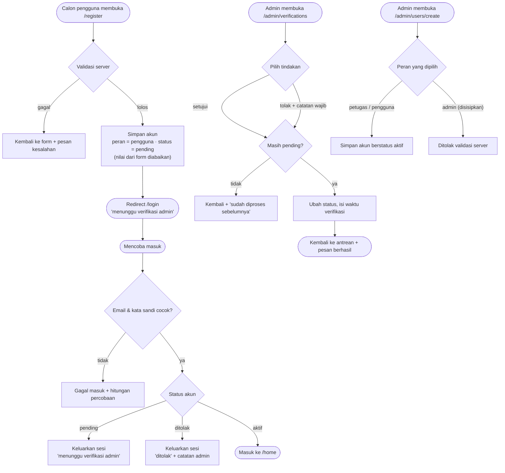

# SRS-002 — Autentikasi & Manajemen Akun

| Info | Isi |
|---|---|
| SRS | SRS-002 — Autentikasi & Manajemen Akun |
| PIC | PM (hybrid) |
| Branch | `feature/auth-akun` |
| User Story | US-13 (registrasi mandiri), US-14 (admin membuat akun), US-15 (verifikasi admin) |
| Agent AI yang dipakai | Claude Code (Opus 5) |
| Status | 🔵 Siap dibuka PR ke `main` |
| Periode | 2026-09-20 – 2026-09-20 |
| Pull Request | `<link PR>` |

---

## 1. Ringkasan

SRS-002 menutup seluruh jalur masuk ke aplikasi. Orang luar bisa mendaftar sendiri, tetapi akunnya
belum bisa dipakai sampai admin memeriksanya: status awalnya `pending` dan pendaftar tidak langsung
masuk. Admin punya dua halaman baru — antrean verifikasi untuk menyetujui atau menolak pendaftar
(disertai catatan yang akan dibaca si pendaftar), serta halaman pembuatan akun yang menjadi
satu-satunya jalur lahirnya akun petugas. Peran admin tidak pernah bisa dibuat lewat form mana pun.

## 2. Cakupan User Story

| US | Pernyataan (ringkas) | Status | Bukti (URL / halaman) |
|---|---|---|---|
| US-13 | Sebagai calon pengguna, saya bisa mendaftar sendiri dan menunggu persetujuan admin | ✅ | `GET/POST /register` → redirect `/login` dengan pesan menunggu verifikasi |
| US-14 | Sebagai admin, saya bisa membuat akun petugas atau pengguna yang langsung aktif | ✅ | `GET /admin/users`, `GET /admin/users/create`, `POST /admin/users` |
| US-15 | Sebagai admin, saya bisa menyetujui atau menolak pendaftar beserta catatan | ✅ | `GET /admin/verifications`, `PATCH .../approve`, `PATCH .../reject` |
| Aturan bisnis 10 | Hanya akun `aktif` yang boleh masuk | ✅ | `POST /login` untuk akun `pending`/`ditolak` |

## 3. File yang Dibuat / Diubah

Sumber: `git diff --name-status main...HEAD`. Seluruhnya milik SRS-002 (AGENTS.md bagian F).

| Status | File | Keterangan |
|---|---|---|
| M | `app/Http/Controllers/Auth/RegisterController.php` | validasi jenis pengguna & NIM/NIP, peran dan status diisi eksplisit, tanpa masuk otomatis |
| M | `app/Http/Controllers/Auth/LoginController.php` | akun `pending`/`ditolak` dikeluarkan kembali beserta penjelasannya |
| M | `views/auth/register.blade.php` | form daftar dengan jenis pengguna (wajib) dan NIM/NIP (opsional) |
| M | `routes/auth-akun.php` | 6 route admin dalam satu grup `auth` + `role:admin` |
| A | `app/Http/Controllers/Admin/UserController.php` | daftar akun bersaringan + pembuatan akun |
| A | `app/Http/Controllers/Admin/VerificationController.php` | antrean, setujui, dan tolak pendaftar |
| A | `views/admin/users/index.blade.php` | tabel akun + saringan peran/status + label status |
| A | `views/admin/users/create.blade.php` | form pembuatan akun |
| A | `views/admin/verifications/index.blade.php` | antrean verifikasi + modal catatan penolakan + keadaan kosong |
| A | `docs/workflow/SRS-002-auth-akun.md` | dokumen ini |

Tidak ada migration, model, seeder, service, middleware, layout, maupun `routes/web.php` yang disentuh.

## 4. Route

Sumber: `php artisan route:list --path=admin` ditambah route auth bawaan.

| Method | URL | Nama route | Middleware | Keterangan |
|---|---|---|---|---|
| GET | `/register` | `register` | `web`, `guest` | form daftar mandiri |
| POST | `/register` | — | `web`, `guest` | simpan sebagai `pengguna`/`pending`, lalu ke `/login` |
| POST | `/login` | — | `web`, `guest` | menolak akun yang belum aktif |
| GET | `/admin/users` | `admin.users.index` | `web`, `auth`, `role:admin` | daftar akun + saringan peran & status |
| GET | `/admin/users/create` | `admin.users.create` | `web`, `auth`, `role:admin` | form pembuatan akun |
| POST | `/admin/users` | `admin.users.store` | `web`, `auth`, `role:admin` | simpan akun berstatus aktif |
| GET | `/admin/verifications` | `admin.verifications.index` | `web`, `auth`, `role:admin` | antrean `pending`, terlama di atas |
| PATCH | `/admin/verifications/{user}/approve` | `admin.verifications.approve` | `web`, `auth`, `role:admin` | jadikan aktif |
| PATCH | `/admin/verifications/{user}/reject` | `admin.verifications.reject` | `web`, `auth`, `role:admin` | jadikan ditolak + catatan wajib |

## 5. Alur Proses



## 6. Aturan Bisnis & Validasi

| Field / aturan | Validasi server | Validasi client | Pesan error |
|---|---|---|---|
| `name` (daftar & admin) | `required\|string\|max:255` | `required`, `maxlength=255` | "Kolom nama wajib diisi." |
| `email` | `required\|email\|max:255\|unique:users,email` | `type=email`, `required`, `maxlength` | "Email sudah digunakan." |
| `password` | `required\|min:8\|confirmed` | `minlength=8`, pencocokan ulangi kata sandi lewat JS | "Kolom kata sandi minimal 8 karakter." |
| `user_type` (daftar) | `required` + `Rule::in(array_keys(User::USER_TYPES))` | `<select required>` | "Kolom jenis pengguna wajib diisi." |
| `user_type` (admin) | `nullable\|required_if:role,pengguna` + `Rule::in(...)` | `required` otomatis saat peran = pengguna | "Kolom jenis pengguna wajib diisi bila peran bernilai pengguna." |
| `identity_number` | `nullable\|string\|max:30` | `maxlength=30` | "Kolom NIM/NIP tidak boleh lebih dari 30 karakter." |
| `role` (admin) | `required` + `Rule::in(['petugas','pengguna'])` | pilihan admin tidak ditampilkan | "Pilihan peran tidak valid." |
| `verification_note` (tolak) | `required\|string\|max:500` | `<textarea required maxlength=500>` | "Kolom catatan verifikasi wajib diisi." |
| Peran & status akun baru | diisi eksplisit di controller, tidak pernah dibaca dari request | — | — |
| Setujui/tolak | hanya untuk akun berstatus `pending` | — | "Akun … sudah diproses sebelumnya." |
| Masuk aplikasi | hanya status `aktif` | — | "Akun Anda menunggu verifikasi admin." / "Pendaftaran Anda ditolak. Catatan admin: …" |

## 7. Keamanan

- [x] Seluruh route admin memakai `auth` + `role:admin`
- [x] Otorisasi pemilik data: tidak relevan di SRS ini (tidak ada data milik pengguna yang dibuka); pembatasan memakai peran
- [x] Tidak ada `$request->all()` yang disimpan; pembuatan akun memakai hasil validasi, sedangkan `role`, `status`, `verification_note`, dan `verified_at` diisi eksplisit di controller
- [x] Enum divalidasi `Rule::in(array_keys(User::USER_TYPES))` dan daftar peran yang diizinkan
- [x] Blade memakai `{{ }}`; catatan penolakan ditampilkan lewat pesan error Laravel, bukan HTML mentah
- [x] Semua form memakai `@csrf`; tindakan setujui/tolak memakai `@method('PATCH')`
- [x] Upload: tidak ada di SRS ini
- [x] Transisi status ber-whitelist: setujui/tolak hanya menerima akun `pending`
- [x] Throttle masuk bawaan tetap aktif; sesi diperbarui saat masuk dan dimusnahkan saat akun ditolak
- [x] Catatan tambahan: peran `admin` tidak ada di daftar pilihan mana pun, sehingga tidak ada jalur menaikkan hak akses lewat form

## 8. Uji Acceptance

Data uji: seeder baseline (`admin@`, `budi@`, `petugas@`, `pending@`, `ditolak@kampus.test`, kata sandi `password`)
ditambah akun yang dibuat selama pengujian (`rina@`, `sari@`, `penyusup@`, `petugas2@kampus.test`).
Perintah persiapan: `php artisan migrate:fresh --seed && php artisan serve`

| No | Skenario | Langkah | Hasil diharapkan | Hasil aktual | Status |
|---|---|---|---|---|---|
| 1 | Daftar akun baru | isi form daftar lengkap dengan jenis pengguna dan NIM | tidak masuk otomatis, muncul pesan menunggu verifikasi, di database `pengguna`/`pending` | `POST /register` → 302 ke `/login`; `/home` tetap menolak; pesan "Pendaftaran berhasil. Akun Anda menunggu verifikasi admin."; database: `role=pengguna status=pending jenis=mahasiswa nim=2024010777` | ✅ |
| 2 | Masuk dengan akun belum aktif | coba masuk sebagai akun baru, `pending@`, dan `ditolak@` | ditolak dengan penjelasan yang sesuai | akun baru & `pending@`: "Akun Anda menunggu verifikasi admin."; `ditolak@`: "Pendaftaran Anda ditolak. Catatan admin: NIM tidak terdaftar pada data akademik."; ketiganya tidak punya sesi | ✅ |
| 3 | Admin menyetujui akun baru | buka `/admin/verifications` → Setujui | akun bisa masuk dan mendarat di beranda pengguna | pesan "Akun Rina Baru disetujui dan sudah bisa masuk."; masuk → `/home` 200 berisi kartu "Cari Fasilitas" | ✅ |
| 4 | Admin menolak dengan catatan | buka antrean → Tolak → isi catatan | akun ditolak, catatan tampil saat akun itu mencoba masuk | tanpa catatan: dikembalikan dengan error; dengan catatan: "Akun Pending Mahasiswa ditolak beserta catatannya."; saat masuk muncul "Pendaftaran Anda ditolak. Catatan admin: Data NIM tidak cocok dengan berkas akademik." | ✅ |
| 5 | Admin membuat petugas | `/admin/users/create` → peran petugas | akun aktif, masuk langsung ke dashboard petugas | "Akun Petugas Dua (Petugas) berhasil dibuat dan langsung aktif."; masuk → `/home` dialihkan ke `/petugas` (200) | ✅ |
| 6 | Uji serang: sisipkan `role=admin` & `status=aktif` di form daftar | kirim field tambahan lewat permintaan POST | tetap `pengguna`/`pending` | database: `role=pengguna status=pending verified_at=null` | ✅ |
| 7 | Uji serang: `POST /admin/users` dengan `role=admin` | kirim peran admin | ditolak validasi, akun tidak tersimpan | "Pilihan peran tidak valid."; akun tidak tersimpan; jumlah admin tetap 1. Peran pengguna tanpa jenis juga ditolak: "Kolom jenis pengguna wajib diisi bila peran bernilai pengguna." | ✅ |
| 8 | Uji serang: akses paksa halaman admin | budi, petugas, dan tamu membuka halaman admin | budi & petugas 403, tamu diarahkan ke login | budi: 403 pada ketiga halaman; petugas: 403; tamu: 302 ke `/login`; budi PATCH setujui dengan token sah: 403; POST tanpa token CSRF: 419; form daftar publik tidak punya field peran/status | ✅ |
| 9 | Proses ulang akun yang sudah diputuskan | setujui akun yang sudah ditolak | ditolak dengan pesan | "sudah diproses sebelumnya"; status di database tidak berubah | ✅ |

Hasil `php artisan test`: **27 passed (92 assertions)** — seluruh pengujian baseline tetap hijau setelah perubahan SRS-002.

## 9. Screenshot

| No | Fitur | File | Penjelasan singkat (untuk dokumen Word) |
|---|---|---|---|
| 1 | Form daftar | `docs/screenshots/SRS-002-01.png` | Form pendaftaran dengan jenis pengguna dan NIM/NIP |
| 2 | Pesan menunggu verifikasi | `docs/screenshots/SRS-002-02.png` | Halaman masuk setelah pendaftaran berhasil |
| 3 | Penolakan masuk | `docs/screenshots/SRS-002-03.png` | Pesan untuk akun yang ditolak beserta catatan admin |
| 4 | Antrean verifikasi | `docs/screenshots/SRS-002-04.png` | Daftar pendaftar dengan tombol setujui dan tolak |
| 5 | Modal catatan penolakan | `docs/screenshots/SRS-002-05.png` | Kotak isian catatan yang wajib diisi |
| 6 | Kelola user | `docs/screenshots/SRS-002-06.png` | Tabel akun dengan saringan peran dan status |
| 7 | Form buat akun | `docs/screenshots/SRS-002-07.png` | Pembuatan akun petugas, pilihan admin tidak tersedia |

## 10. Kendala & Solusi

| Kendala | Penyebab | Solusi |
|---|---|---|
| Titik pemeriksaan status akun saat masuk | `laravel/ui` sudah menangani kecocokan kata sandi sendiri | Memakai kait `authenticated()` milik `AuthenticatesUsers`; mengembalikan response di sana membatalkan pengalihan bawaan, sehingga throttle dan pembaruan sesi tetap berjalan |
| Pesan penolakan sempat tidak terlihat saat pengujian | pesan sekali-pakai sudah terpakai oleh permintaan pengecekan sebelumnya | Urutan pengujian diperbaiki: halaman masuk diperiksa lebih dulu sebelum permintaan lain |
| Jenis pengguna tidak relevan untuk petugas | satu form dipakai untuk dua peran | Baris jenis pengguna disembunyikan otomatis saat peran petugas dipilih, dan server memakai `required_if` serta mengosongkan nilainya untuk petugas |

## 11. HANDOFF UNTUK PM

| Kebutuhan | File terkait | Alasan | Dampak bila tidak ada | Status |
|---|---|---|---|---|
| Ubah peran/status akun yang sudah ada dan penonaktifan akun | `Admin/UserController` | Tidak diminta US-14; ruang lingkup SRS-002 hanya pembuatan akun | Admin harus lewat database bila perlu menonaktifkan akun | Menunggu keputusan PM |
| Pengujian otomatis untuk alur akun | `tests/Feature/` | Folder `tests/` bukan milik SRS-002 menurut AGENTS.md bagian F | Alur akun baru terjamin lewat pengujian manual saja | Menunggu keputusan PM |
| Tautan "Verifikasi" di menu admin sudah ada sejak baseline | `views/layouts/app.blade.php` | Milik baseline | Tidak ada; sudah berfungsi | Selesai |

## 12. Riwayat Commit

```text
Menambah jenis pengguna dan NIM/NIP di form daftar, akun baru menunggu verifikasi (SRS-002)
Menolak masuk untuk akun yang belum disetujui admin (SRS-002)
Menambah halaman admin untuk kelola akun dan verifikasi pendaftar (SRS-002)
Menambah laporan pengerjaan SRS-002
```

## 13. Poin Presentasi (± 1 menit)

1. **Masalah yang diselesaikan:** siapa pun bisa mendaftar, tetapi kampus tetap memegang kendali —
   tidak ada akun yang bisa dipakai sebelum admin memeriksanya, dan akun petugas hanya lahir dari tangan admin.
2. **Demo singkat:** daftar akun baru → coba masuk, ditolak "menunggu verifikasi" → admin menyetujui →
   masuk berhasil → admin membuat petugas baru → petugas masuk dan langsung mendarat di dashboardnya.
3. **Keputusan teknis yang layak dibanggakan:** peran dan status tidak pernah dibaca dari isian form,
   selalu ditetapkan di server, sehingga penyisipan `role=admin` lewat DevTools tidak berpengaruh sama sekali —
   sudah dibuktikan pada skenario uji 6 dan 7.
4. **Kendala terbesar & cara mengatasinya:** mencari tempat yang tepat untuk memeriksa status akun
   tanpa mematikan throttle dan pembaruan sesi bawaan; diselesaikan lewat kait `authenticated()`.
5. **Pertanyaan yang mungkin muncul & jawabannya:**
   - *Kenapa pendaftar tidak langsung masuk?* Aturan bisnis 9: status awal `pending`, admin yang memutuskan.
   - *Bagaimana kalau tombol setujui ditekan dua kali?* Permintaan kedua ditolak karena statusnya sudah bukan `pending`.
   - *Bisakah orang membuat akun petugas dari halaman daftar?* Tidak — form daftar tidak punya pilihan peran,
     dan server selalu menetapkannya sebagai `pengguna`.
