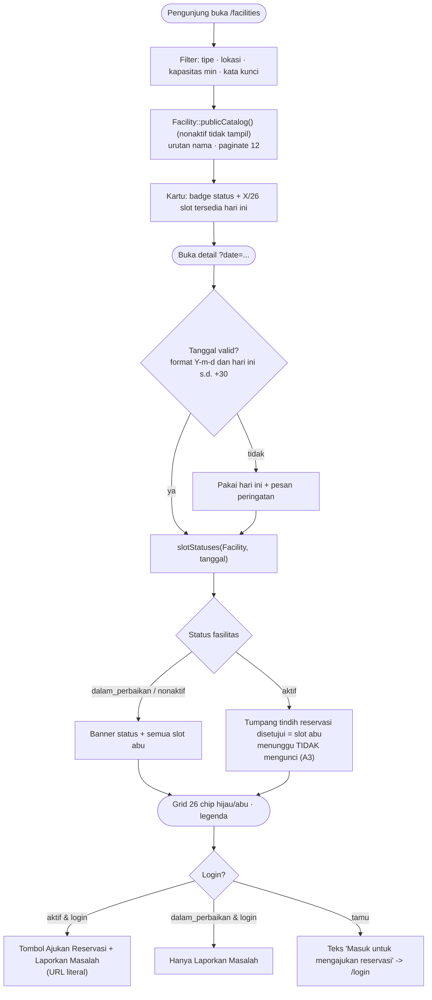

# SRS-003 — Katalog & Ketersediaan Fasilitas

| Info | Isi |
|---|---|
| SRS | SRS-003 — Katalog & Ketersediaan Fasilitas (publik) |
| PIC | Programmer 1 |
| Branch | `feature/fasilitas-katalog` |
| User Story | US-1, US-2 |
| Agent AI yang dipakai | OpenCode |
| Status | 🔵 PR dibuka |
| Periode | 2026-09-22 – 2026-09-22 |
| Pull Request | `<link PR>` (diisi anggota saat membuka PR) |

---

## 1. Ringkasan

Dibangun katalog fasilitas publik (tanpa login) ala Booking.com: filter bar
(tipe/lokasi/kapasitas minimal/kata kunci), kartu fasilitas, dan halaman detail
dengan pemilih tanggal + grid 26 slot ala Skedda (chip hijau = tersedia, abu =
tidak tersedia). Pengunjung bisa melihat ketersediaan tanpa pernah melihat nama
pemohon atau tujuan penggunaan (privasi US-1). Tombol "Ajukan Reservasi" dan
"Laporkan Masalah" memakai URL literal sehingga aman di-merge sebelum SRS-005/007.

## 2. Cakupan User Story

| US | Pernyataan (ringkas) | Status | Bukti (URL / halaman) |
|---|---|---|---|
| US-1 | Sebagai pengunjung, saya dapat melihat daftar fasilitas beserta ketersediaan slot tanpa login. | ✅ | `GET /facilities` |
| US-2 | Sebagai pengunjung, saya dapat melihat grid slot tersedia/tidak tersedia per tanggal tanpa detail pemohon. | ✅ | `GET /facilities/{id}?date=Y-m-d` |

## 3. File yang Dibuat / Diubah

Sumber: `git diff --name-status origin/main...HEAD`

| Status | File | Keterangan |
|---|---|---|
| M | `routes/fasilitas-katalog.php` | Route publik `facilities.index` & `facilities.show` |
| A | `app/Http/Controllers/FacilityCatalogController.php` | Filter katalog + logika tanggal + render grid |
| A | `views/facilities/index.blade.php` | Filter bar + kartu fasilitas + ringkasan slot |
| A | `views/facilities/show.blade.php` | Info fasilitas + pemilih tanggal + grid 26 chip + aksi |
| A | `docs/workflow/SRS-003-fasilitas-katalog.md` | Dokumen ini |

## 4. Route

Sumber: `php artisan route:list --path=facilities`

| Method | URL | Nama route | Middleware | Keterangan |
|---|---|---|---|---|
| GET | `/facilities` | `facilities.index` | (publik) | Katalog + filter, paginate 12 |
| GET | `/facilities/{facility}` | `facilities.show` | (publik) | Detail + grid ketersediaan per tanggal |

Kedua route TANPA auth sesuai kontrak E3 — pengunjung tidak perlu login (US-1/2).

## 5. Alur Proses



## 6. Aturan Bisnis & Validasi

| Field / aturan | Validasi server | Validasi client | Pesan error |
|---|---|---|---|
| `type` (filter) | `Rule::in(array_keys(Facility::TYPES))` | select (opsional) | validasi redirect + error flash |
| `location` (filter) | opsional, `string maks 100` | select dari lokasi distinct | — |
| `min_capacity` (filter) | opsional, `integer min:1` | `type=number min=1` | validasi redirect + error flash |
| `q` (filter) | opsional, `string maks 100`; wildcard `% _` di-escape dengan `addcslashes` agar harfiah | `type=search` | — |
| `date` (show) | parse `Y-m-d` + roundtrip; rentang hari ini s.d. `+30` hari | `input type=date min/max` + tombol sebelumnya/berikutnya | "Tanggal tidak valid atau di luar rentang (hari ini s.d. 30 hari ke depan). Menampilkan hari ini." |
| Slot tersedia | hanya selisih dengan reservasi `disetujui` (A2, A3); `menunggu` tidak mengunci | — | — |
| Ketersediaan | fasilitas `aktif`: `AvailabilityService::slotStatuses`; selain itu 26 slot abu (A7) | — | — |
| Privasi | `slotStatuses()` tidak pernah mengembalikan nama pemohon/tujuan | — | — |

## 7. Keamanan

- [x] Route non-publik memakai `role:` yang tepat (kedua route memang publik — kontrak E3)
- [x] Otorisasi pemilik data via Policy + `Gate::authorize()` (tidak relevan: halaman publik)
- [x] Tidak ada `$request->all()`; hanya `$request->validate()` untuk query filter
- [x] Enum divalidasi `Rule::in(array_keys(...))` (type fasilitas)
- [x] Output memakai `{{ }}` / `{!! nl2br(e(...)) !!}` (hanya untuk deskripsi fasilitas)
- [x] Semua form memakai `@csrf` (form filter memakai GET, tanpa @csrf)
- [x] Upload tervalidasi (tidak relevan)
- [x] Transisi status ber-whitelist di server (tidak relevan)
- [ ] Catatan tambahan: halaman publik tidak pernah memuat nama pemohon, tujuan, maupun ID reservasi (H). Uji #6 memverifikasi view source kosong dari data tersebut.

## 8. Uji Acceptance

Data uji: seeder baseline — `RSV-1..9`, akun budi/citra/dimas@kampus.test.
Perintah persiapan: `php artisan migrate:fresh --seed && php artisan serve`

| No | Skenario | Langkah | Hasil diharapkan | Hasil aktual | Status |
|---|---|---|---|---|---|
| 1 | Tamu tanpa login | 1) buka `/facilities` 2) buka `/facilities/4` | 200, kartu + detail tampil | HTTP 200 untuk keduanya | ✅ |
| 2 | Filter `q=lab` + `min_capacity=30` | 1) buka `/facilities?q=lab&min_capacity=30` | Hanya Lab Komputer 1; Lapangan Futsal (nonaktif) tidak pernah muncul | 1 kartu = Lab Komputer 1; Futsal tidak ada | ✅ |
| 3 | Grid Lab Komputer 1 besok | 1) buka `/facilities/4?date=H+1` | Slot 09.00/09.30/10.00 tidak tersedia (RSV-1 disetujui 09.00–10.30); 10.30 tersedia walau RSV-6 `menunggu` | 26 slot; 09.00/09.30/10.00 = Tidak tersedia; 10.30 = Tersedia | ✅ |
| 4 | Lab Bahasa + nonaktif | 1) buka `/facilities/5` 2) buka `/facilities/8` 3) buka `/facilities` | Banner + 26 slot abu; banner nonaktif; Futsal tidak di katalog | 26/26 abu + banner; banner nonaktif ada; Futsal tidak tampil | ✅ |
| 5 | `?date` invalid | 1) `?date=2020-01-01` 2) `?date=abc` | Kembali ke hari ini + pesan | Pesan tampil; tanggal ditampilkan = hari ini (2026-09-22) | ✅ |
| 6 | Privasi US-1 | 1) view source `/facilities/4?date=H+1` | Tidak ada nama budi/citra/dimas, tujuan, ID reservasi | Tidak ada sama sekali | ✅ |
| 7 | Tombol aksi | 1) tamu buka detail 2) login budi → detail aktif 3) budi → `/facilities/5` | tamu: teks masuk→/login tanpa Laporkan; budi: Ajukan + Laporkan (URL literal); nonaktif: tanpa Ajukan | Sesuai semua | ✅ |
| 8 | Filter tipe | 1) buka `/facilities?type=lapangan` | Hanya Lapangan Basket (1 kartu), Aula Utama tidak muncul | 1 kartu; Aula tidak ada | ✅ |
| 9 | Uji serang: `type=bogus-type`, `min_capacity=-5` | 1) `curl -s -o NUL -w "%{http_code}"` | Ditolak server (redirect validasi 302) | HTTP 302 untuk keduanya | ✅ |
| 10 | Uji serang: `/facilities/9999` | 1) curl | 404 | HTTP 404 | ✅ |

Hasil `php artisan test`: 27 passed, 92 assertions (regresi baseline depan). Uji acceptance lewat HTTP dijalankan pada `php artisan serve` lokal (lihat tabel di atas — semua lulus).

## 9. Screenshot

| No | Fitur | File | Penjelasan singkat (untuk dokumen Word) |
|---|---|---|---|
| 1 | Katalog + filter bar | `docs/screenshots/SRS-003-01.png` | Filter bar Booking.com + kartu fasilitas beserta badge status dan ringkasan slot "X/26 tersedia hari ini" (placeholder). |
| 2 | Detail + grid ketersediaan | `docs/screenshots/SRS-003-02.png` | Pemilih tanggal + grid 26 chip hijau/abu ala Skedda + tombol Ajukan/Laporkan (placeholder). |
| 3 | Banner status + tombol tamu | `docs/screenshots/SRS-003-03.png` | Banner "dalam perbaikan" dengan 26 slot abu dan teks "Masuk untuk mengajukan reservasi" (placeholder). |

## 10. Kendala & Solusi

| Kendala | Penyebab | Solusi |
|---|---|---|
| `500 Vite manifest not found` saat `php artisan serve` | `node_modules`/`public/build` tidak ada (gitignored) | `npm install --ignore-scripts` + `npm run build`; tidak ada file milik PM yang berubah |
| Karakter non-ASCII (en dash label slot) merusak skrip uji | PS 5.1 membaca `.ps1` sebagai ANSI bila tanpa BOM | Simpan skrip uji ber-BOM UTF-8 |
| Deteksi 302 validasi di PS gagal (Exception.Response null) | Perilaku `Invoke-WebRequest -MaximumRedirection 0` di PS 5.1 | Verifikasi final memakai `curl.exe -w "%{http_code}"` → 302 benar |
| `npm install` mengubah `package-lock.json` (milik PM) | npm 10 menormalkan `name` lockfile | Di-revert `git checkout -- package-lock.json` |

## 11. HANDOFF UNTUK PM

| Kebutuhan | File terkait | Alasan | Dampak bila tidak ada | Status |
|---|---|---|---|---|
| Tidak ada | — | Semua kebutuhan SRS-003 terpenuhi dalam scope | — | Selesai |

## 12. Riwayat Commit

```text
3cc81a9 feat(fasilitas): katalog publik & grid ketersediaan slot (SRS-003, US-1)
d456a89 feat(fasilitas): tampilan katalog, filter, dan detail ketersediaan (SRS-003, US-2)
<hash> docs(fasilitas): workflow SRS-003
```

## 13. Poin Presentasi (± 1 menit)

1. **Masalah yang diselesaikan:** pengunjung (tanpa login) bisa mencari fasilitas dan melihat ketersediaan slot harian tanpa menyentuh data privat pemohon — persis privasi US-1.
2. **Demo singkat:** buka `/facilities` → filter "lab" + kapasitas ≥ 30 → Lab Komputer 1 → pilih besok → 09.00–10.30 abu, 10.30 hijau → buka Lab Bahasa → banner + 26 slot abu.
3. **Keputusan teknis yang layak dibanggakan:** memakai `AvailabilityService::slotStatuses()` (kontrak PM) sehingga reservasi `menunggu` tidak mengunci slot, dan wildcard LIKE di-escape agar pencarian harfiah.
4. **Kendala terbesar & cara mengatasinya:** env lokal belum punya `public/build` (Vite) → build ulang `npm run build` tanpa menyentuh file milik PM.
5. **Pertanyaan yang mungkin muncul & jawabannya:** "Kenapa slot 10.30 hijau padahal RSV-6 10.00–11.00 menunggu?" → karena hanya `disetujui` yang mengunci slot (A3); beberapa pengajuan boleh antre, petugas yang memilih.