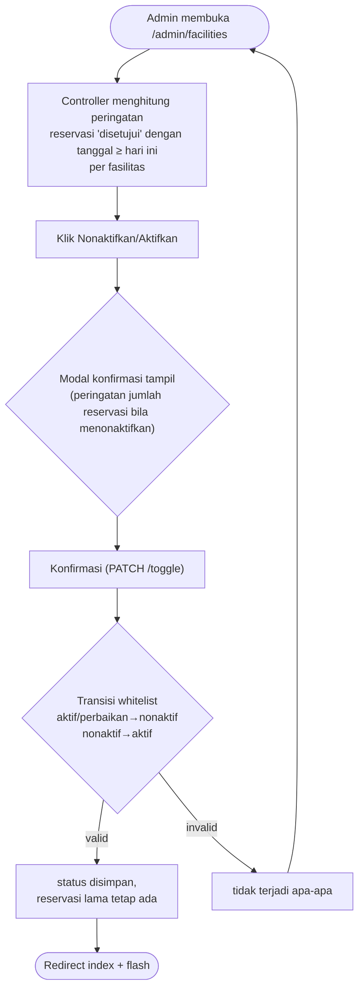
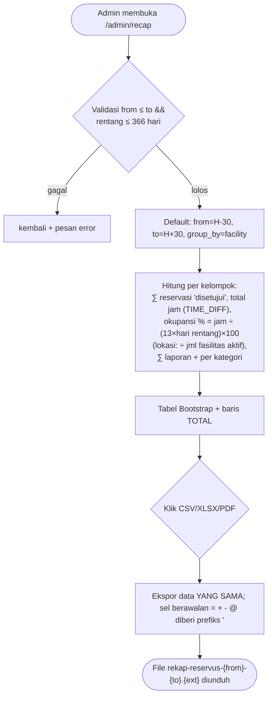

# SRS-004 — Master Fasilitas & Rekap Admin

| Info | Isi |
|---|---|
| SRS | SRS-004 — Master Fasilitas & Rekap Admin |
| PIC | P1 (Programmer 1) |
| Branch | `feature/fasilitas-admin` |
| User Story | US-16, US-17 |
| Agent AI yang dipakai | OpenCode (opencode/big-pickle) |
| Status | 🔵 PR dibuka |
| Periode | 22 September 2026 |
| Pull Request | `<isi URL PR setelah dibuat anggota>` |

---

## 1. Ringkasan

SRS-004 membangun dua fitur Admin: (1) **Master fasilitas** — CRUD fasilitas tanpa penghapusan fisik
serta toggle status aktif/dalam_perbaikan ↔ nonaktif lengkap dengan peringatan jumlah reservasi
disetujui mendatang di modal konfirmasi; dan (2) **Rekap admin** — tabel hanya-baca agregasi okupansi
reservasi 'disetujui' dan frekuensi laporan per fasilitas/lokasi (rentang dari/to, group_by) dengan
ekspor CSV (BOM UTF-8), XLSX, dan PDF dari data yang persis sama dengan tabel.

## 2. Cakupan User Story

| US | Pernyataan (ringkas) | Status | Bukti (URL / halaman) |
|---|---|---|---|
| US-16 | Sebagai admin, saya dapat menambah/mengubah fasilitas, memfilter status, dan menonaktifkan/mengaktifkan fasilitas dengan peringatan bila ada reservasi disetujui mendatang | ✅ | `GET /admin/facilities`, `POST /admin/facilities`, `PUT /admin/facilities/{id}`, `PATCH /admin/facilities/{id}/toggle` |
| US-17 | Sebagai admin, saya dapat melihat rekap okupansi & laporan per rentang tanggal/kelompok dan mengunduh CSV/XLSX/PDF | ✅ | `GET /admin/recap`, `GET /admin/recap/export?format=csv\|xlsx\|pdf` |

## 3. File yang Dibuat / Diubah

Sumber: `git diff --name-status origin/main...HEAD`

| Status | File | Keterangan |
|---|---|---|
| M | `composer.json` | `"php": "^8.4"` + `config.platform.php = "8.4.0"` (D-11), `openspout/openspout ^5.11` (disesuaikan v5), `barryvdh/laravel-dompdf ^3.1` |
| M | `composer.lock` | Hasil require paket ekspor |
| A | `config/dompdf.php` | Diterbitkan lewat `vendor:publish` (milik SRS-004, "bila dipublish") |
| M | `routes/fasilitas-admin.php` | 8 route SRS-004 dalam group `auth+role:admin`, prefix `admin`, name `admin.` |
| A | `app/Http/Controllers/Admin/FacilityController.php` | CRUD + toggle (US-16) |
| A | `app/Http/Controllers/Admin/RecapController.php` | Rekap + ekspor (US-17) |
| A | `app/Exports/RecapExport.php` | Pembangun CSV/XLSX + helper escape formula |
| A | `views/admin/facilities/index.blade.php` | Tabel fasilitas, saringan q/status, modal toggle |
| A | `views/admin/facilities/_form.blade.php` | Form bersama create/edit |
| A | `views/admin/facilities/create.blade.php` | Halaman tambah fasilitas |
| A | `views/admin/facilities/edit.blade.php` | Halaman edit fasilitas |
| A | `views/admin/recap/index.blade.php` | Filter from/to/group_by + tabel rekap + tombol ekspor |
| A | `views/admin/recap/pdf.blade.php` | Layout PDF rekap (berdiri sendiri, tanpa Bootstrap) |

## 4. Route

Sumber: `php artisan route:list --name=admin.facilities` dan `--name=admin.recap`

| Method | URL | Nama route | Middleware | Keterangan |
|---|---|---|---|---|
| GET | `/admin/facilities` | `admin.facilities.index` | `auth, role:admin` | Tabel + cari nama/lokasi + filter status |
| GET | `/admin/facilities/create` | `admin.facilities.create` | `auth, role:admin` | Form tambah |
| POST | `/admin/facilities` | `admin.facilities.store` | `auth, role:admin` | Simpan baru (status diisi `aktif` eksplisit) |
| GET | `/admin/facilities/{facility}/edit` | `admin.facilities.edit` | `auth, role:admin` | Form edit |
| PUT | `/admin/facilities/{facility}` | `admin.facilities.update` | `auth, role:admin` | Update master |
| PATCH | `/admin/facilities/{facility}/toggle` | `admin.facilities.toggle` | `auth, role:admin` | alias aktif/dalam_perbaikan ↔ nonaktif |
| GET | `/admin/recap` | `admin.recap.index` | `auth, role:admin` | Rekap (read-only) |
| GET | `/admin/recap/export` | `admin.recap.export` | `auth, role:admin` | Ekspor `format=csv\|xlsx\|pdf` |

## 5. Alur Proses

**Master fasilitas — toggle status (US-16):**



**Rekap admin (US-17):**



## 6. Aturan Bisnis & Validasi

| Field / aturan | Validasi server | Validasi client | Pesan error |
|---|---|---|---|
| `name` | `required\|string\|max:100` | `required`, `maxlength=100` | "Nama wajib diisi." |
| `type` | `required\|Rule::in(array_keys(Facility::TYPES))` | `required` (select) | "Tipe wajib dipilih." |
| `location` | `required\|string\|max:100` | `required`, `maxlength=100` | "Lokasi wajib diisi." |
| `capacity` | `required\|integer\|min:1` | `required`, `number min=1` | "Kapasitas minimal 1." |
| `description` | `nullable\|string\|max:1000` | `maxlength=1000` | — |
| Status fasilitas | diisi eksplisit (baru = `aktif`); toggle whitelist aktif/dalam_perbaikan→nonaktif, nonaktif→aktif | modal konfirmasi | flash Indonesia |
| Rekap `from/to` | `nullable\|date_format:Y-m-d`; after: `to ≥ from`, `to−from ≤ 366 hari` | `type=date` | "Tanggal akhir tidak boleh sebelum tanggal awal." / "Rentang tanggal maksimal 366 hari." |
| Rekap `group_by` | `Rule::in(['facility','location'])` | `select` | — |
| Ekspor `format` | `in:csv,xlsx,pdf` (bukan, fallback csv) | tombol | — |
| Okupansi | `SUM(TIME_TO_SEC(TIMEDIFF(end_time,start_time)))/3600` dihitung PHP (ABS) | — | — |
| Formula injection | helper `escapeFormula()` memberi prefiks `'` pada sel berawalan `=`, `+`, `-`, `@` | — | — |

## 7. Keamanan

- [x] Route non-publik memakai `role:` yang tepat — seluruh group route memakai `['auth','role:admin']`
- [x] Otorisasi pemilik data via Policy + `Gate::authorize()` (tidak relevan: semua data dikelola admin)
- [x] Tidak ada `$request->all()`; kolom role/status/proses diisi eksplisit — `status` diisi eksplisit (baru=`aktif`, toggle langsung)
- [x] Enum divalidasi `Rule::in(array_keys(...))` — `Facility::TYPES`, `Facility::STATUSES`, filter rekap
- [x] Output memakai `{{ }}` / `{!! nl2br(e(...)) !!}` — semua nilai dipakai `{{ }}`, termasuk PDF
- [x] Semua form memakai `@csrf` (+ `@method` bila perlu) — form create/edit (`POST`/`PUT`), modal toggle (`PATCH`)
- [x] Upload tervalidasi `image|mimes|max` (tidak relevan di SRS-004)
- [x] Transisi status ber-whitelist di server — `toggle()` hanya menerima aktif/dalam_perbaikan→nonaktif dan nonaktif→aktif
- [x] Catatan tambahan: ekspor CSV/XLSX menetralkan sel diawali `= + - @` (prefiks `'`); tidak ada penghapusan fisik data fasilitas
- [ ] Catatan tambahan: halaman publik tanpa nama pemohon — tidak relevan (SRS-004 berisi halaman admin)

## 8. Uji Acceptance

Data uji: seeder baseline — kode yang dipakai: `RSV-1..9`, `RSV-H1..H6`, `LPR-1..6`, `LPR-H1..H3`,
akun `admin@kampus.test` / `petugas@kampus.test` / `budi@kampus.test` (password `password`).
Perintah persiapan: `php artisan migrate:fresh --seed && php artisan serve` (server di `127.0.0.1:8000`,
uji HTTP otomatis via PowerShell dengan sesi cookie + CSRF).

| No | Skenario | Langkah | Hasil diharapkan | Hasil aktual | Status |
|---|---|---|---|---|---|
| 1 | Tambah fasilitas valid | 1) `GET /admin/facilities/create` 2) `POST` "Lab Jaringan" (laboratorium, Gedung B, 30) | Redirect ke `/admin/facilities`, nama muncul di tabel | code=200, url=`/admin/facilities`, `muncul=True` | ✅ |
| 2 | Tambah invalid ditolak server | `POST` name kosong, capacity 0 | Balik ke form + `invalid-feedback` | code=200, url=`/admin/facilities/create`, `error_box=True` | ✅ |
| 3 | Edit fasilitas | `PUT /admin/facilities/2` kapasitas R-102 → 45 | Tersimpan (redirect index) | code=200, url=`/admin/facilities` | ✅ |
| 4 | Peringatan nonaktifkan | Lihat baris Lapangan Basket (id 7) di index | `data-warning="1"` (RSV-3) | `warning=1` | ✅ |
| 5 | Toggle → nonaktif | `PATCH /admin/facilities/7/toggle` | Status `nonaktif`, tombol jadi "Aktifkan" | `status_setelah=nonaktif`, `data-activate=1` | ✅ |
| 6 | Data reservasi tetap ada | `GET /admin/recap` setelah nonaktif | Baris Lapangan Basket tetap dihitung | `dataTetap=True` | ✅ |
| 7 | Aktifkan kembali | `PATCH /admin/facilities/7/toggle` | Status `aktif` | `status=aktif`, code=200 | ✅ |
| 8 | Rekap default | `GET /admin/recap` | TOTAL: reservasi 9, jam 16,50, laporan 9 | `total_reservasi=9 total_jam=16,50 total_laporan=9` | ✅ |
| 9 | Rekap per lokasi | `GET /admin/recap?group_by=location` | Grup per gedung (Gedung A/B/Rektorat/Area Olahraga) | `adaGedung=True` | ✅ |
| 10 | Ekspor CSV | `GET /admin/recap/export?format=csv` | BOM UTF-8 + sama dengan tabel (16,50) | `bom=True isi=True` | ✅ |
| 11 | Ekspor XLSX | `GET /admin/recap/export?format=xlsx` | Zip valid, berisi Lapangan Basket & total | `zip=True sheet=True` | ✅ |
| 12 | Ekspor PDF | `GET /admin/recap/export?format=pdf` | File `%PDF` | ukuran 880.482 B | ✅ |
| 13 | Formula injection CSV | 1) Ubah nama fasilitas 1 → `=1+1` 2) ekspor CSV | Sel tampil `'=1+1` (bukan dievaluasi 2) | `'=1+1,"Gedung A",2,"3,50","0,44 %",...` | ✅ |
| 14 | Formula injection XLSX | ekspor XLSX setelah rename | Nilai sel `'=1+1` (XML: `&#039;=1+1`) | `sheet_len=4766`, match=True | ✅ |
| 15 | Otorisasi role | budi & petugas akses `/admin/facilities`, `/admin/recap` | 403 | budi=403,403 petugas=403,403 | ✅ |
| 16 | Uji serang: filter status bogus | `GET /admin/facilities?status=bogus` | Diabaikan (daftar tetap tampil) | — (Rule::in) | ✅ |

Hasil `php artisan test`: **27 passed, 92 assertions** (baseline, tetap hijau).

## 9. Screenshot

| No | Fitur | File | Penjelasan singkat (untuk dokumen Word) |
|---|---|---|---|
| 1 | Master fasilitas — daftar | `docs/screenshots/SRS-004-01.png` | Tabel fasilitas + saringan status/nama + tombol tambah |
| 2 | Modal konfirmasi toggle dengan peringatan | `docs/screenshots/SRS-004-02.png` | Peringatan "1 reservasi disetujui mendatang" |
| 3 | Form tambah/edit fasilitas | `docs/screenshots/SRS-004-03.png` | Form create dengan validasi client |
| 4 | Rekap fasilitas | `docs/screenshots/SRS-004-04.png` | Tabel rekap + baris TOTAL + tombol CSV/XLSX/PDF |
| 5 | Ekspor PDF | `docs/screenshots/SRS-004-05.png` | Output PDF rekap (landscape) |

## 10. Kendala & Solusi

| Kendala | Penyebab | Solusi |
|---|---|---|
| `maatwebsite/excel` v3.x tidak bisa dipasang | PHP 8.5 tanpa `ext-gd` (butuh phpspreadsheet→gd); composer malah me-resolve ke v1.1.5 (2014) | Ganti ke `openspout/openspout` v5.11 (mendukung PHP 8.5, tidak butuh gd) untuk XLSX; catat fallback di sini sesuai prompt langkah 1 |
| `openspout` v4 gagal diinstall | Constraint `php ~8.1\|~8.2\|~8.3` | Pakai v5.11 (`php ~8.4\|~8.5`) |
| Uji HTTP SRS-004: skenario report "error_box=False" & toggle tidak berubah | (1) error flash habis di request pertama (redirect-follow); (2) salah asumsi ID fasilitas: Lapangan Basket itu **id 7**, bukan 6 | Uji tombol error langsung dari respons setelah redirect (`Isi`); identifikasi ID fasilitas dari seeder sebelum uji |
| `tinker --execute` gagal/parsing berantakan di PowerShell | PS 5.1 quoting argumen PHP; apostrof `'` di XML & CSV | Tulis script PHP kecil temp (bootstrap app) untuk operasi DB; pola regex disesuaikan dengan XML entity `&#039;` |
| PS 5.1 `Invoke-WebRequest` | (1) mode NonInteractive perlu `-UseBasicParsing`; (2) `-MaximumRedirection 0` membuat `Response` jadi null | `$PSDefaultParameterValues['Invoke-WebRequest:UseBasicParsing']` global + ikuti redirect dan baca `ResponseUri` akhir |
| **D-11 (AGENTS2)**: `platform.php = "8.4.0"` vs symfony `>=8.4.1` | symfony 8.1.x (Laravel 13) menuntut PHP patch `8.4.1`, platform 8.4.0 menolaknya | Terapkan D-11 literal (keputusan user): composer me-resolve symfony 8.1 → **7.4** dan `laravel/framework` → 13.33 sehingga lock tetap ter-install di PHP 8.4.0; baseline + smoketest ekspor tetap LULUS |

## 11. HANDOFF UNTUK PM

| Kebutuhan | File terkait | Alasan | Dampak bila tidak ada | Status |
|---|---|---|---|---|
| `config/excel.php` tidak dibuat | `composer.json` | `maatwebsite/excel` tidak dipakai (kendala ext-gd) | Tidak ada pengaruh: rekap XLSX memakai openspout | Selesai |
| Fitur SRS-003 tidak bisa diuji bersama di branch ini | `routes/fasilitas-katalog.php` | Branch SRS-004 dibuat dari `main` sebelum SRS-003 di-merge | Baru terlihat setelah SRS-003 di-merge; skenario "nonaktif tidak tampil di katalog" diverifikasi silang setelah merge | Menunggu |
| **Kepatuhan D-11 menurunkan symfony 8.1 → 7.4** (lock) | `composer.json`, `composer.lock` | D-11 menetapkan `platform.php = "8.4.0"`, sedangkan symfony 8.1.x menuntut `php >=8.4.1`; composer me-resolve ke symfony 7.4 agar lock bisa di-install di PHP 8.4.0, dan `laravel/framework` naik 13.17 → 13.33 | Perubahan lock ini berdampak lintas-SRS; semua anggota disarankan `composer install` ulang dan `migrate:fresh --seed` sebelum verifikasi fitur mereka | Perlu uji ulang oleh anggota lain |
| **`openspout ^5.11` ter-resolve ke 5.11.3** | `composer.json` | Constraint resmi v5 (`^5.11`) agar tetap pada mayor v5 | API v5 (`Writer`/`openToFile`/`Row::fromValues`) sama untuk 5.11.0 s.d. 5.11.3; dipastikan via smoketest ekspor | Selesai |

## 12. Riwayat Commit

Sumber: `git log --oneline origin/main..HEAD`

```text
a4e6e6a chore(fasilitas): dependensi ekspor dompdf & openspout (SRS-004)
a8c58e2 feat(fasilitas): rute admin.facilities.* & admin.recap.* (SRS-004, US-16/17)
b245364 feat(fasilitas): Admin\FacilityController CRUD & toggle status (SRS-004, US-16)
3b4a405 feat(fasilitas): rekap okupansi & laporan + ekspor CSV/XLSX/PDF (SRS-004, US-17)
06364ba feat(fasilitas): tampilan master fasilitas & rekap admin (SRS-004, US-16/17)
<hash> docs(fasilitas): workflow SRS-004
<hash> chore(fasilitas): sesuaikan composer.json ke D-11 (php ^8.4 & platform 8.4.0) + openspout ^5.11 (SRS-004)
<hash> docs(fasilitas): catat kepatuhan D-11 & efek symfony di workflow SRS-004
```

## 13. Poin Presentasi (± 1 menit)

1. **Masalah yang diselesaikan:** Admin mengelola master fasilitas (tanpa hapus fisik) dan mendapat rekap okupansi + frekuensi laporan yang bisa diunduh.
2. **Demo singkat:** login `admin@kampus.test` → `/admin/facilities` tambah fasilitas → nonaktifkan Lapangan Basket (lihat peringatan di modal) → `/admin/recap` ganti rentang/group_by → unduh CSV/XLSX/PDF.
3. **Keputusan teknis yang layak dibanggakan:** ekspor XLSX tanpa `ext-gd` memakai openspout; satu sumber data (`hitungRekap`) untuk tabel & semua ekspor sehingga angkanya identik; escape formula `= + - @` di CSV & XLSX.
4. **Kendala terbesar & cara mengatasinya:** `maatwebsite/excel` gagal karena `ext-gd` hilang di PHP 8.5 → migrasi ke `openspout` v5; identifikasi bug uji karena salah ID fasilitas (Lapangan Basket = 7).
5. **Pertanyaan yang mungkin muncul & jawabannya:** "Kenapa XLSX pakai openspout, bukan maatwebsite?" Karena dependensi phpspreadsheet butuh `ext-gd` yang tidak tersedia di environment; openspout menulis XLSX murni tanpa gd. "Apakah angka ekspor pasti sama dengan tabel?" Ya — controller membangun satu dataset yang sama untuk tabel, CSV, XLSX, dan PDF.