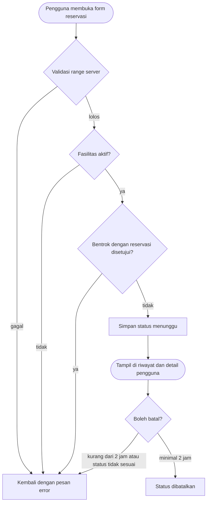

# SRS-005 — Reservasi Pengguna

| Info | Isi |
|---|---|
| SRS | SRS-005 — Reservasi Pengguna |
| PIC | Programmer 2 (P2) |
| Branch | `feature/reservasi-user` |
| User Story | US-3, US-4, US-5 |
| Agent AI yang dipakai | GitHub Copilot |
| Status | 🟡 Dikerjakan |
| Periode | 2026-09-23 – sekarang |
| Pull Request | Belum dibuat |

## 1. Ringkasan

Fitur ini memungkinkan pengguna aktif mengajukan reservasi fasilitas, melihat riwayat dan detail reservasi miliknya, serta membatalkan reservasi yang masih memenuhi batas minimal dua jam sebelum mulai. Validasi waktu, fasilitas aktif, bentrok, status, dan kepemilikan dilakukan di server.

## 2. Cakupan User Story

| US | Pernyataan (ringkas) | Status | Bukti (URL / halaman) |
|---|---|---|---|
| US-3 | Sebagai pengguna, saya bisa mengajukan reservasi pada slot waktu tertentu. | ✅ | `GET /reservations/create`, `POST /reservations` |
| US-4 | Sebagai pengguna, saya bisa melihat riwayat dan detail reservasi saya. | ✅ | `GET /reservations`, `GET /reservations/{reservation}` |
| US-5 | Sebagai pengguna, saya bisa membatalkan reservasi milik saya sesuai batas waktu. | ✅ | `PATCH /reservations/{reservation}/cancel` |

## 3. File yang Dibuat / Diubah

| Status | File | Keterangan |
|---|---|---|
| A | `app/Http/Controllers/ReservationController.php` | Alur pengajuan, riwayat, detail, dan pembatalan |
| A | `app/Policies/ReservationPolicy.php` | Otorisasi pemilik reservasi |
| M | `routes/reservasi-user.php` | Route SRS-005 dengan middleware pengguna |
| A | `views/reservations/index.blade.php` | Riwayat dan filter status |
| A | `views/reservations/create.blade.php` | Form pengajuan |
| A | `views/reservations/show.blade.php` | Detail dan pembatalan |
| A | `tests/Feature/ReservationUserTest.php` | Uji fitur inti dan keamanan |
| A | `docs/workflow/SRS-005-reservasi-user.md` | Dokumen workflow |

## 4. Route

| Method | URL | Nama route | Middleware | Keterangan |
|---|---|---|---|---|
| GET | `/reservations` | `reservations.index` | `auth, role:pengguna` | Riwayat reservasi |
| GET | `/reservations/create` | `reservations.create` | `auth, role:pengguna` | Form pengajuan |
| POST | `/reservations` | `reservations.store` | `auth, role:pengguna` | Simpan pengajuan |
| GET | `/reservations/{reservation}` | `reservations.show` | `auth, role:pengguna` | Detail milik pengguna |
| PATCH | `/reservations/{reservation}/cancel` | `reservations.cancel` | `auth, role:pengguna` | Batalkan reservasi |

## 5. Alur Proses

## 6. Aturan Bisnis & Validasi

| Field / aturan | Validasi server | Pesan error |
|---|---|---|
| `facility_id` | `required`, `exists`; fasilitas harus `aktif` | Fasilitas tidak aktif dan tidak dapat dipesan. |
| `reservation_date` | `required`, `date_format:Y-m-d`; service membatasi hari ini sampai 30 hari | Tanggal reservasi tidak valid atau di luar rentang. |
| `start_time`, `end_time` | Service membatasi 07.00–20.00, kelipatan 30 menit, dan start < end | Jam reservasi harus valid. |
| Bentrok | Hanya dibandingkan dengan status `disetujui` melalui `AvailabilityService` | Slot yang dipilih sudah digunakan. |
| `purpose` | `required`, string 10–2000 karakter | Tujuan penggunaan wajib diisi. |
| Pembatalan | Hanya status `menunggu`/`disetujui`, pemilik, dan minimal 120 menit sebelum mulai | Reservasi tidak dapat dibatalkan. |

## 7. Keamanan

- [x] Route non-publik memakai `auth` dan `role:pengguna`.
- [x] Detail dan pembatalan memakai `ReservationPolicy` dan `Gate::authorize()`.
- [x] Tidak memakai `$request->all()`; `status`, `user_id`, dan kolom pemrosesan diisi terkontrol.
- [x] Output Blade di-escape; tujuan multi-baris memakai `nl2br(e(...))`.
- [x] Semua form memakai `@csrf`; pembatalan memakai `@method('PATCH')`.
- [x] Fasilitas nonaktif/dalam perbaikan ditolak di server meski ID dikirim manual.

## 8. Uji Acceptance

Data uji: factory lokal dan seeder baseline. Perintah persiapan: `php artisan migrate:fresh --seed`.

| No | Skenario | Hasil aktual | Status |
|---|---|---|---|
| 1 | Pengajuan valid tersimpan dengan status `menunggu`. | Lulus pada `ReservationUserTest`. | ✅ |
| 2 | Range 07.15–08.00 ditolak server. | Lulus pada `ReservationUserTest`. | ✅ |
| 3 | Bentrok dengan reservasi `disetujui` ditolak server. | Lulus pada `ReservationUserTest`. | ✅ |
| 4 | Pengguna lain membuka detail reservasi mendapat 403. | Lulus pada `ReservationUserTest`. | ✅ |
| 5 | Pembatalan minimal dua jam berhasil dan pembatalan terlambat ditolak. | Lulus pada `ReservationUserTest`. | ✅ |

Hasil `php vendor/bin/phpunit tests/Feature/ReservationUserTest.php`: 4 tests passed, 19 assertions.

## 9. Screenshot

Belum diambil.

## 10. Kendala & Solusi

| Kendala | Penyebab | Solusi |
|---|---|---|
| `php artisan test` tidak tersedia | Proyek menjalankan PHPUnit langsung melalui vendor binary | Gunakan `php vendor/bin/phpunit` |

## 11. HANDOFF UNTUK PM

| Kebutuhan | File terkait | Alasan | Dampak bila tidak ada | Status |
|---|---|---|---|---|
| Tidak ada | – | Semua kebutuhan SRS-005 berada pada file milik P2. | – | Selesai |

## 12. Riwayat Commit

Belum ada commit pada branch ini.

## 13. Poin Presentasi (± 1 menit)

1. **Masalah yang diselesaikan:** pengguna dapat mengajukan dan mengelola reservasi tanpa mengakses data pengguna lain.
2. **Demo singkat:** login sebagai pengguna → buka `Reservasi Saya` → ajukan slot valid → lihat status `Menunggu` → buka detail → batalkan sebelum batas waktu.
3. **Keputusan teknis:** semua aturan waktu dan bentrok memakai `AvailabilityService` sebagai sumber kebenaran.
4. **Kendala terbesar:** validasi harus tetap menolak manipulasi ID fasilitas dan jam dari request manual.
5. **Pertanyaan yang mungkin muncul:** reservasi `menunggu` tidak mengunci slot; hanya reservasi `disetujui` yang dihitung bentrok sesuai aturan bisnis.
