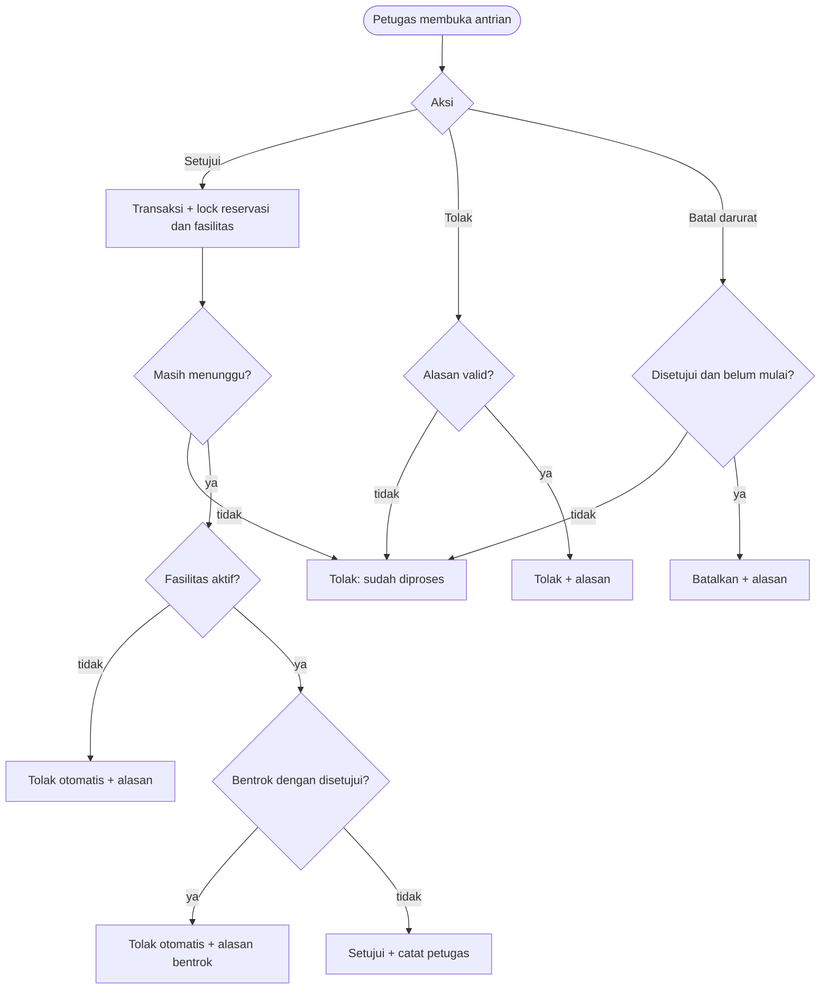

# SRS-006 — Pemrosesan Reservasi Petugas

| Info | Isi |
|---|---|
| SRS | SRS-006 — Pemrosesan Reservasi Petugas |
| PIC | Programmer 2 (P2) |
| Branch | `feature/reservasi-petugas` |
| User Story | US-8, US-9, US-10 |
| Agent AI yang dipakai | GitHub Copilot |
| Status | 🟡 Dikerjakan |
| Periode | 2026-09-23 – sekarang |
| Pull Request | Belum dibuat |

## 1. Ringkasan

Fitur ini memungkinkan petugas melihat antrian reservasi, menyetujui pengajuan yang lolos pemeriksaan, menolak pengajuan dengan alasan, dan membatalkan reservasi disetujui yang belum dimulai dalam kondisi darurat. Approval mengunci reservasi dan fasilitas dalam transaksi, kemudian memeriksa ulang konflik sebelum menyimpan keputusan.

## 2. Cakupan User Story

| US | Pernyataan (ringkas) | Status | Bukti (URL / halaman) |
|---|---|---|---|
| US-8 | Sebagai petugas, saya bisa melihat antrian reservasi yang menunggu. | ✅ | `GET /petugas`, `GET /petugas/reservations` |
| US-9 | Sebagai petugas, saya bisa menyetujui atau menolak reservasi. | ✅ | `PATCH /petugas/reservations/{reservation}/approve`, `PATCH /petugas/reservations/{reservation}/reject` |
| US-10 | Sebagai petugas, saya bisa membatalkan reservasi mendatang dengan alasan. | ✅ | `PATCH /petugas/reservations/{reservation}/cancel` |

## 3. File yang Dibuat / Diubah

| Status | File | Keterangan |
|---|---|---|
| A | `app/Http/Controllers/Petugas/ReservationController.php` | Queue, detail, approval, rejection, emergency cancellation |
| M | `routes/reservasi-petugas.php` | Route SRS-006 dengan middleware petugas |
| A | `views/petugas/reservations/index.blade.php` | Tab antrian dan penanda konflik |
| A | `views/petugas/reservations/show.blade.php` | Detail dan panel aksi |
| A | `views/petugas/partials/reservation-queue.blade.php` | Partial antrian di dashboard petugas |
| A | `tests/Feature/ReservationPetugasTest.php` | Uji acceptance SRS-006 |
| A | `docs/workflow/SRS-006-reservasi-petugas.md` | Dokumen workflow |

## 4. Route

| Method | URL | Nama route | Middleware | Keterangan |
|---|---|---|---|---|
| GET | `/petugas/reservations` | `petugas.reservations.index` | `auth, role:petugas` | Tab menunggu/disetujui mendatang/semua |
| GET | `/petugas/reservations/{reservation}` | `petugas.reservations.show` | `auth, role:petugas` | Detail dan aksi reservasi |
| PATCH | `/petugas/reservations/{reservation}/approve` | `petugas.reservations.approve` | `auth, role:petugas` | Approval transaksional |
| PATCH | `/petugas/reservations/{reservation}/reject` | `petugas.reservations.reject` | `auth, role:petugas` | Penolakan dengan alasan |
| PATCH | `/petugas/reservations/{reservation}/cancel` | `petugas.reservations.cancel` | `auth, role:petugas` | Pembatalan darurat dengan alasan |

## 5. Alur Proses

## 6. Aturan Bisnis & Validasi

| Field / aturan | Validasi server | Pesan error |
|---|---|---|
| Akses | `auth`, `role:petugas` | Pengguna biasa mendapat 403. |
| Approval | Hanya status `menunggu`; fasilitas harus `aktif`; konflik dicek ulang di transaksi | Reservasi sudah diproses, fasilitas tidak aktif, atau bentrok. |
| Konflik | `start_lama < end_baru` dan `end_lama > start_baru`; reservasi yang sedang diproses diabaikan | Ditolak otomatis karena bentrok. |
| `rejection_reason` | Wajib, string 5–1000 karakter | Alasan penolakan wajib diisi. |
| `cancel_reason` | Wajib, string 5–1000 karakter | Alasan pembatalan wajib diisi. |
| Pembatalan darurat | Hanya status `disetujui` dan waktu mulai belum lewat | Hanya reservasi disetujui yang belum lewat yang dapat dibatalkan. |
| Kolom proses | `processed_by`, `processed_at`, `cancelled_by`, `cancelled_at` diisi eksplisit | Tidak menerima status dari mass assignment. |

## 7. Keamanan

- [x] Semua route memakai `auth` dan `role:petugas`.
- [x] Transisi status di-whitelist berdasarkan status aktual di dalam transaksi.
- [x] Approval memakai `lockForUpdate()` pada reservasi dan fasilitas.
- [x] Semua form memakai `@csrf` dan `@method('PATCH')`.
- [x] Alasan wajib divalidasi server, bukan hanya atribut HTML.
- [x] Output nama, email, tujuan, dan alasan memakai escaping Blade.

## 8. Uji Acceptance

Data uji: factory lokal dan fixture baseline RSV-1 sampai RSV-9. Perintah persiapan: `php artisan migrate:fresh --seed`.

| No | Skenario | Hasil aktual | Status |
|---|---|---|---|
| 1 | Antrian petugas tampil dan pengguna biasa mendapat 403. | Lulus pada `ReservationPetugasTest`. | ✅ |
| 2 | Approval valid mengubah status menjadi `disetujui` dan mencatat petugas. | Lulus pada `ReservationPetugasTest`. | ✅ |
| 3 | Approval reservasi bentrok otomatis menjadi `ditolak` dengan alasan. | Lulus pada `ReservationPetugasTest`. | ✅ |
| 4 | Fasilitas tidak aktif menyebabkan penolakan otomatis. | Lulus pada `ReservationPetugasTest`. | ✅ |
| 5 | Tolak tanpa alasan ditolak server; dengan alasan berhasil. | Lulus pada `ReservationPetugasTest`. | ✅ |
| 6 | Batal darurat tanpa alasan ditolak; reservasi mendatang berhasil; reservasi lewat tidak berubah. | Lulus pada `ReservationPetugasTest`. | ✅ |
| 6 | Dua approval bersamaan hanya boleh menghasilkan satu reservasi disetujui. | Lock fasilitas diterapkan; uji browser paralel perlu dilakukan saat demo integrasi. | ⚠️ |

Hasil `php vendor/bin/phpunit tests/Feature/ReservationPetugasTest.php`: 6 tests passed, 22 assertions.

## 9. Screenshot

Belum diambil.

## 10. Kendala & Solusi

| Kendala | Penyebab | Solusi |
|---|---|---|
| Approval bersamaan berisiko menghasilkan dua status disetujui | Konflik dapat berubah setelah halaman antrian dibuka | Kunci baris fasilitas dan reservasi di dalam transaksi, lalu cek ulang konflik sebelum update. |

## 11. HANDOFF UNTUK PM

| Kebutuhan | File terkait | Alasan | Dampak bila tidak ada | Status |
|---|---|---|---|---|
| Tidak ada | – | Semua kebutuhan SRS-006 berada pada file milik P2. | – | Selesai |

## 12. Riwayat Commit

Belum ada commit pada branch ini.

## 13. Poin Presentasi (± 1 menit)

1. **Masalah yang diselesaikan:** petugas dapat memproses antrian reservasi tanpa menyetujui jadwal yang bentrok.
2. **Demo singkat:** buka dashboard petugas → buka antrian → setujui RSV-4 → setujui RSV-5 → RSV-5 otomatis ditolak karena bentrok.
3. **Keputusan teknis:** lock fasilitas dan re-check konflik dilakukan di dalam transaksi database.
4. **Kendala terbesar:** halaman antrian bisa dibuka bersamaan oleh dua petugas, sehingga pemeriksaan di halaman saja tidak cukup.
5. **Pertanyaan yang mungkin muncul:** reservasi `menunggu` tidak mengunci slot; hanya approval yang mengunci setelah transaksi berhasil.
