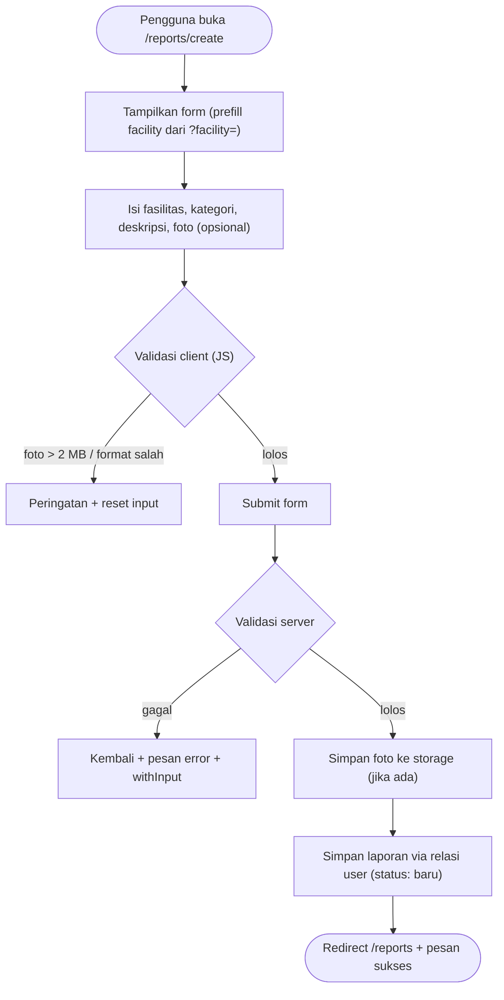
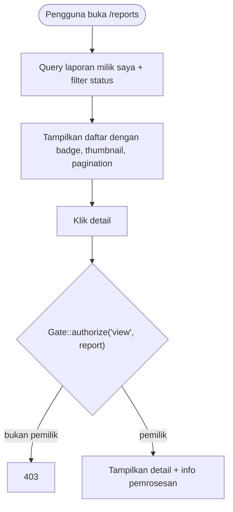

# SRS-007 — Laporan Pengguna

| Info | Isi |
|---|---|
| SRS | SRS-007 — `Laporan Pengguna` |
| PIC | `Programmer 3` |
| Branch | `feature/laporan-user` |
| User Story | US-6, US-7 |
| Agent AI yang dipakai | `Antigravity (Claude Opus 4.6)` |
| Status | 🟡 Dikerjakan |
| Periode | `2026-09-22` – `2026-09-22` |
| Pull Request | _(belum dibuka)_ |

---

## 1. Ringkasan

Fitur laporan pengguna memungkinkan pengguna (mahasiswa/dosen/staf) untuk melaporkan kerusakan, masalah kebersihan, peralatan, atau masalah lainnya pada fasilitas kampus. Pengguna dapat mengirim laporan beserta foto bukti, melihat riwayat laporan yang pernah dikirim, dan melihat detail serta status pemrosesan laporan.

## 2. Cakupan User Story

| US | Pernyataan (ringkas) | Status | Bukti (URL / halaman) |
|---|---|---|---|
| US-6 | Sebagai pengguna, saya bisa membuat laporan kerusakan/masalah fasilitas dengan foto | ✅ | `POST /reports` |
| US-7 | Sebagai pengguna, saya bisa melihat riwayat dan detail laporan saya | ✅ | `GET /reports`, `GET /reports/{id}` |

## 3. File yang Dibuat / Diubah

| Status | File | Keterangan |
|---|---|---|
| M (ubah) | `routes/laporan-user.php` | Route group auth+role:pengguna |
| A (baru) | `app/Http/Controllers/ReportController.php` | Controller: index, create, store, show |
| A (baru) | `app/Policies/ReportPolicy.php` | Policy: view (hanya pelapor) |
| A (baru) | `views/reports/index.blade.php` | Riwayat laporan + filter status + thumbnail |
| A (baru) | `views/reports/create.blade.php` | Form buat laporan + upload foto + preview JS |
| A (baru) | `views/reports/show.blade.php` | Detail laporan + info pemrosesan |

## 4. Route

| Method | URL | Nama route | Middleware | Keterangan |
|---|---|---|---|---|
| GET | `/reports` | `reports.index` | `auth, role:pengguna` | Riwayat laporan saya |
| GET | `/reports/create` | `reports.create` | `auth, role:pengguna` | Form buat laporan |
| POST | `/reports` | `reports.store` | `auth, role:pengguna` | Simpan laporan baru |
| GET | `/reports/{report}` | `reports.show` | `auth, role:pengguna` | Detail laporan |

## 5. Alur Proses

### US-6: Buat Laporan



### US-7: Riwayat & Detail Laporan



## 6. Aturan Bisnis & Validasi

| Field / aturan | Validasi server | Validasi client | Pesan error |
|---|---|---|---|
| `facility_id` | `required\|exists:facilities,id` | `required` select | "Fasilitas wajib dipilih." |
| `category` | `required\|Rule::in(array_keys(Report::CATEGORIES))` | `required` select | "Kategori tidak valid." |
| `description` | `required\|string\|min:10\|max:2000` | `required`, `minlength=10`, `maxlength=2000` | "Deskripsi minimal 10 karakter." |
| `photo` | `nullable\|image\|mimes:jpg,jpeg,png\|max:2048` | `accept="image/jpeg,image/png"` + JS cek ukuran | "Format foto harus JPG, JPEG, atau PNG." |
| Status tidak bisa dimanipulasi | Tidak ada di `$fillable`; status default DB | — | — |

## 7. Keamanan

- [x] Route non-publik memakai `role:pengguna`
- [x] Otorisasi pemilik data via Policy + `Gate::authorize('view', $report)`
- [x] Tidak ada `$request->all()`; user_id diisi lewat relasi, status dari default DB
- [x] Enum divalidasi `Rule::in(array_keys(Report::CATEGORIES))`
- [x] Output memakai `{{ }}` / `{!! nl2br(e(...)) !!}`
- [x] Semua form memakai `@csrf`
- [x] Upload tervalidasi `image|mimes:jpg,jpeg,png|max:2048`, simpan dengan `->store()` (nama acak)
- [x] Status 'baru' dari default database, tidak bisa dimanipulasi lewat form

## 8. Uji Acceptance

Data uji: seeder baseline — kode yang dipakai: `LPR-1..6`, `LPR-H1..H3`, akun `budi@kampus.test`, `citra@kampus.test`.
Perintah persiapan: `php artisan migrate:fresh --seed` lalu `php artisan serve`

| No | Skenario | Langkah | Hasil diharapkan | Hasil aktual | Status |
|---|---|---|---|---|---|
| 1 | Laporan R-101 kategori kerusakan + foto jpg | Login budi → /reports/create → isi form + pilih foto jpg → kirim | Tersimpan, foto tampil di detail | _(uji manual)_ | ⏳ |
| 2 | Laporan tanpa foto | Login budi → /reports/create → isi form tanpa foto → kirim | Tersimpan tanpa foto | _(uji manual)_ | ⏳ |
| 3 | Upload file invalid | Upload pdf, gambar > 2 MB, file PHP rename .jpg | Ditolak server | _(uji manual)_ | ⏳ |
| 4 | Riwayat budi | Login budi → /reports | Tampil LPR-1, LPR-4, LPR-5; filter status bekerja | _(uji manual)_ | ⏳ |
| 5 | Detail LPR-5 | Login budi → /reports/{id LPR-5} | Tampil catatan resolusi & petugas pemroses | _(uji manual)_ | ⏳ |
| 6 | XSS deskripsi | Deskripsi berisi `<script>alert(1)</script>` | Tampil sebagai teks biasa | _(uji manual)_ | ⏳ |
| 7 | Sisipkan status=selesai | Tambah input hidden status=selesai via DevTools | Tetap 'baru' | _(uji manual)_ | ⏳ |
| 8 | IDOR: budi buka LPR-3 milik citra | Login budi → /reports/{id LPR-3} | 403 Forbidden | _(uji manual)_ | ⏳ |

## 9. Screenshot

| No | Fitur | File | Penjelasan singkat (untuk dokumen Word) |
|---|---|---|---|
| 1 | Riwayat Laporan | `docs/screenshots/SRS-007-01.png` | Halaman riwayat laporan dengan filter status |
| 2 | Form Buat Laporan | `docs/screenshots/SRS-007-02.png` | Form pembuatan laporan dengan upload foto |
| 3 | Detail Laporan | `docs/screenshots/SRS-007-03.png` | Detail laporan dengan catatan resolusi |

## 10. Kendala & Solusi

| Kendala | Penyebab | Solusi |
|---|---|---|
| _(belum ditemukan)_ | — | — |

## 11. HANDOFF UNTUK PM

Tidak ada.

## 12. Riwayat Commit

```text
f61b484 feat(laporan): tambah fitur laporan pengguna (SRS-007, US-6, US-7)
```

## 13. Poin Presentasi (± 1 menit)

1. **Masalah yang diselesaikan:** Pengguna membutuhkan cara mudah untuk melaporkan kerusakan/masalah fasilitas kampus beserta bukti foto.
2. **Demo singkat:** Login `budi@kampus.test` → buat laporan dengan foto → lihat riwayat → buka detail → cek filter status.
3. **Keputusan teknis yang layak dibanggakan:** Preview foto client-side dengan validasi tipe & ukuran sebelum upload, policy auto-discovery untuk proteksi IDOR.
4. **Kendala terbesar & cara mengatasinya:** _(akan diisi setelah pengujian)_
5. **Pertanyaan yang mungkin muncul & jawabannya:** "Mengapa semua fasilitas bisa dilaporkan termasuk nonaktif?" — Karena laporan bisa berkaitan dengan kondisi fisik fasilitas terlepas dari status operasionalnya.
