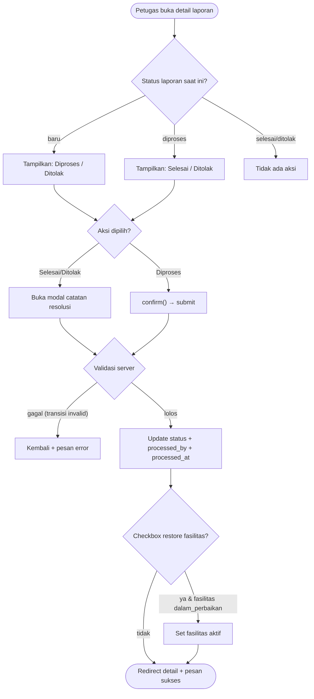
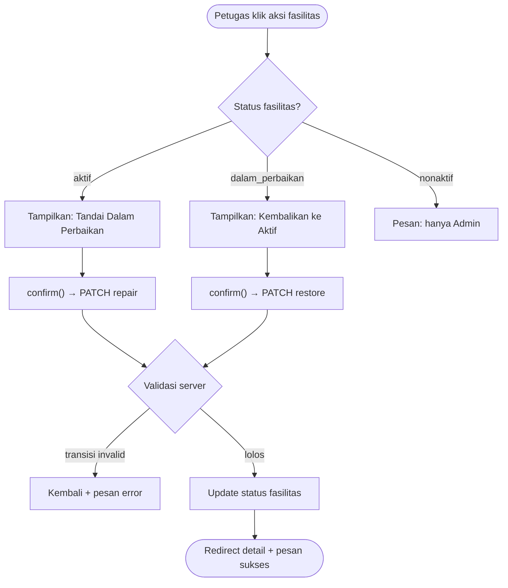

# SRS-008 — Pemrosesan Laporan & Status Perbaikan

| Info | Isi |
|---|---|
| SRS | SRS-008 — `Pemrosesan Laporan & Status Perbaikan` |
| PIC | `Programmer 3` |
| Branch | `feature/laporan-petugas` |
| User Story | US-8, US-11, US-12 |
| Agent AI yang dipakai | `Antigravity (Claude Opus 4.6)` |
| Status | 🟡 Dikerjakan |
| Periode | `2026-09-22` – `2026-09-22` |
| Pull Request | _(belum dibuka)_ |

---

## 1. Ringkasan

Fitur pemrosesan laporan memungkinkan petugas untuk mengelola seluruh laporan kerusakan dan masalah fasilitas yang dikirim oleh pengguna. Petugas dapat melihat antrian laporan di dashboard, mengubah status laporan (baru → diproses → selesai/ditolak), serta mengubah status fasilitas antara aktif dan dalam perbaikan. Fitur ini juga menyediakan partial untuk dashboard petugas yang menampilkan ringkasan antrian laporan.

## 2. Cakupan User Story

| US | Pernyataan (ringkas) | Status | Bukti (URL / halaman) |
|---|---|---|---|
| US-8 | Sebagai petugas, saya melihat ringkasan laporan di dashboard | ✅ | Partial `petugas.partials.report-queue` |
| US-11 | Sebagai petugas, saya bisa mengubah status laporan | ✅ | `PATCH /petugas/reports/{id}/status` |
| US-12 | Sebagai petugas, saya bisa mengubah status fasilitas (aktif ↔ dalam perbaikan) | ✅ | `PATCH /petugas/reports/{id}/facility-status` |

## 3. File yang Dibuat / Diubah

| Status | File | Keterangan |
|---|---|---|
| M (ubah) | `routes/laporan-petugas.php` | Route group auth+role:petugas, prefix petugas |
| A (baru) | `app/Http/Controllers/Petugas/ReportController.php` | Controller: index, show, status, facilityStatus |
| A (baru) | `views/petugas/partials/report-queue.blade.php` | Partial dashboard: antrian laporan masuk |
| A (baru) | `views/petugas/reports/index.blade.php` | Tabel antrian laporan + tab status |
| A (baru) | `views/petugas/reports/show.blade.php` | Detail laporan + panel aksi status |

## 4. Route

| Method | URL | Nama route | Middleware | Keterangan |
|---|---|---|---|---|
| GET | `/petugas/reports` | `petugas.reports.index` | `auth, role:petugas` | Antrian laporan |
| GET | `/petugas/reports/{report}` | `petugas.reports.show` | `auth, role:petugas` | Detail laporan + aksi |
| PATCH | `/petugas/reports/{report}/status` | `petugas.reports.status` | `auth, role:petugas` | Ubah status laporan |
| PATCH | `/petugas/reports/{report}/facility-status` | `petugas.reports.facility-status` | `auth, role:petugas` | Ubah status fasilitas |

## 5. Alur Proses

### US-11: Ubah Status Laporan



### US-12: Ubah Status Fasilitas



## 6. Aturan Bisnis & Validasi

| Field / aturan | Validasi server | Validasi client | Pesan error |
|---|---|---|---|
| `status` (laporan) | `required\|Rule::in($allowed)` — whitelist dari status saat ini | Tombol sesuai transisi valid | "Transisi status tidak diperbolehkan." |
| `resolution_note` | `required_if status in selesai,ditolak\|min:5\|max:1000` | `required`, `minlength=5`, `maxlength=1000` di modal | "Catatan resolusi wajib diisi." |
| `action` (fasilitas) | `required\|Rule::in(['repair','restore'])` | Tombol sesuai status fasilitas | "Aksi tidak valid." |
| Transisi fasilitas | Whitelist: aktif→dalam_perbaikan, dalam_perbaikan→aktif | — | "Hanya fasilitas berstatus aktif yang bisa ditandai dalam perbaikan." |
| Fasilitas nonaktif | Ditolak server | Pesan info di UI | "Perubahan status hanya bisa dilakukan oleh Admin." |

## 7. Keamanan

- [x] Route non-publik memakai `role:petugas`
- [x] Tidak ada `$request->all()`; processed_by/processed_at diisi eksplisit
- [x] Enum divalidasi `Rule::in(array_keys(...))` dan `Rule::in($allowed)`
- [x] Output memakai `{{ }}` / `{!! nl2br(e(...)) !!}`
- [x] Semua form memakai `@csrf` + `@method('PATCH')`
- [x] Transisi status ber-whitelist di server (`ALLOWED_TRANSITIONS`)
- [x] Status fasilitas: petugas hanya aktif ↔ dalam_perbaikan; nonaktif ditolak server

## 8. Uji Acceptance

Data uji: seeder baseline — kode yang dipakai: `LPR-1..6`, `LPR-H1..H3`, akun `petugas@kampus.test`, `budi@kampus.test`.
Perintah persiapan: `php artisan migrate:fresh --seed` lalu `php artisan serve`

| No | Skenario | Langkah | Hasil diharapkan | Hasil aktual | Status |
|---|---|---|---|---|---|
| 1 | Partial dashboard | Login petugas → /petugas | Partial menampilkan LPR-1 s.d. LPR-4 | _(uji manual)_ | ⏳ |
| 2 | LPR-2 → diproses → dalam perbaikan → selesai + restore | Login petugas → detail LPR-2 → diproses → tandai Aula dalam perbaikan → selesai + catatan + centang restore | Aula kembali aktif | _(uji manual)_ | ⏳ |
| 3 | LPR-4 → ditolak dengan catatan | Login petugas → detail LPR-4 → ditolak + catatan | Status ditolak, catatan tersimpan | _(uji manual)_ | ⏳ |
| 4 | LPR-1 → selesai + restore Lab Bahasa | Login petugas → detail LPR-1 → selesai + catatan + restore | Lab Bahasa aktif | _(uji manual)_ | ⏳ |
| 5 | Transisi invalid: LPR-5 selesai → baru | PATCH /petugas/reports/{LPR-5}/status dengan status=baru | Ditolak server | _(uji manual)_ | ⏳ |
| 6 | Restore fasilitas nonaktif | PATCH facility-status restore untuk Lapangan Futsal (nonaktif) | Ditolak server | _(uji manual)_ | ⏳ |
| 7 | Akses unauthorized | Login budi → /petugas/reports | 403 Forbidden | _(uji manual)_ | ⏳ |
| 8 | Tanpa catatan resolusi saat selesai | Hapus atribut required lewat DevTools → submit | Ditolak server | _(uji manual)_ | ⏳ |

## 9. Screenshot

| No | Fitur | File | Penjelasan singkat (untuk dokumen Word) |
|---|---|---|---|
| 1 | Partial Dashboard | `docs/screenshots/SRS-008-01.png` | Kartu antrian laporan di dashboard petugas |
| 2 | Antrian Laporan | `docs/screenshots/SRS-008-02.png` | Tabel antrian laporan dengan tab status |
| 3 | Detail + Aksi | `docs/screenshots/SRS-008-03.png` | Detail laporan dengan panel aksi status |
| 4 | Modal Resolusi | `docs/screenshots/SRS-008-04.png` | Modal catatan resolusi saat menutup laporan |

## 10. Kendala & Solusi

| Kendala | Penyebab | Solusi |
|---|---|---|
| _(belum ditemukan)_ | — | — |

## 11. HANDOFF UNTUK PM

Tidak ada.

## 12. Riwayat Commit

```text
6108e23 feat(laporan): tambah pemrosesan laporan petugas (SRS-008, US-8, US-11, US-12)
```

## 13. Poin Presentasi (± 1 menit)

1. **Masalah yang diselesaikan:** Petugas membutuhkan antarmuka untuk memproses laporan kerusakan/masalah dan mengelola status fasilitas terkait.
2. **Demo singkat:** Login `petugas@kampus.test` → lihat dashboard (partial) → buka antrian → proses LPR-2: diproses → tandai fasilitas dalam perbaikan → selesai dengan catatan + restore fasilitas.
3. **Keputusan teknis yang layak dibanggakan:** Whitelist transisi status di server (`ALLOWED_TRANSITIONS`), modal Bootstrap untuk catatan resolusi, checkbox opsional restore fasilitas saat menutup laporan.
4. **Kendala terbesar & cara mengatasinya:** _(akan diisi setelah pengujian)_
5. **Pertanyaan yang mungkin muncul & jawabannya:** "Mengapa petugas tidak bisa mengubah status fasilitas nonaktif?" — Karena status nonaktif adalah wewenang Admin (aturan bisnis 8). Petugas hanya boleh toggle antara aktif dan dalam_perbaikan.
